# Atelier « démo/effetgraphique »  (Familiarisation à `minifb`)

### Programmation d'effets démo rétros (demoscene années 80/90) en C

---

> Cet atelier demande de bien connaître les bases en C (pointeurs, allocation dynamique, arithmétique de base). Il montre comment mettre en œuvre des effets classiques et faciles à appréhender avec une bibliothèque minimaliste d’affichage d’images : `minifb`. Vous pourrez ensuite transposer ce qui est vu ici dans une autre bibliothèque (SDL3, Raylib…) ou dans un autre langage associé au framework ad hoc.
>
> Par ailleurs contrairement à d’autres ateliers je ne détaillerai pas point par point tous les algorithmes ou implémentations, c’est un atelier de niveau avancé où vous devez avoir quelques bases ou expérience dans la programmation, la programmation graphique ou de jeux vidéos.
>
> Cet atelier sera suivi d’un **second atelier qui présentera uniquement la théorie et les principes**  sous-tendant différents effets graphiques (effet « feu » et autre effets de particules, distorsions 2D, effets sur des sprites ou scrollings, fractales, glitch, 3D, etc.) ou des techniques de traitement d’image (normalisation, filtres morphologiques et de convolution). Charge à vous de les implémenter à partir de ce que nous auront vu ici (thème de la GameJam 2026).

## Table des matières

1. [Installation et setup](#1-installation-et-setup)
2. [API de minifb](#2-api-de-minifb)
3. [Exemple 1 : Image fixe et primitives](#3-exemple-1--image-fixe-et-primitives)
4. [Exemple 2 : Animation de primitives](#4-exemple-2--animation-de-primitives)
5. [Effet 1 : Scrolling et sinus scroller](#5-effet-1--scrolling-et-sinus-scroller)
6. [Effet 2 : Starfield 2D](#6-effet-2--starfield-2d)
7. [Effet 3 : Starfield avancé](#7-effet-3--starfield-avancé)
8. [Effet 4 : Palette cycling](#8-effet-4--palette-cycling)
9. [Effet 5 : Tunnel](#9-effet-5--tunnel)
10. [Effet 6 : Plasma](#10-effet-6--plasma)

## 1. Installation et setup

### Philosophie de minifb

Avant d'installer quoi que ce soit, il est utile de présenter [`minifb`](https://github.com/emoon/minifb) (Mini FrameBuffer). C’est une bibliothèque en C à **responsabilité unique** : ouvrir une fenêtre système et y afficher un tableau de pixels. C'est tout. Il n'y a pas de gestion audio, pas de chargement de sprites ou d’image, pas de moteur de scène. Cette austérité est volontaire car elle a un intérêt pédagogique : on fait tout soi-même (on apprend donc toutes les opérations élémentaires de traitement), et elle impose de penser en termes de buffer mémoire, exactement comme le faisaient les programmeurs demoscene sur Amiga ou DOS.

Imaginez simplement que l’écran est similaire à grande feuille de papier quadrillé où chaque case est un pixel. Une image à afficher sera simplement un tableau d'entiers en mémoire, et vous y écrivez des valeurs qui correspondront à des niveaux de gris (1 entier par case) ou des couleurs (3 entiers par case). Lorsque vous appelez la fonction d'affichage de `minifb`, ce tableau est tout bêtement copié vers l'écran. C'est le cycle fondamental de toute démo (et jeu ou autre application graphique dynamique) : **calculer → copier → afficher → recommencer**.
Si on souhaite afficher des images animées, il faudra simplement recalculer l’image entre chaque affichage. Sur de machines aux ressources limitées il fallait faire preuve d’ingéniosité pour arriver à faire les calculs suffisamment rapidement pour ne pas ralentir la fréquence d’affichage et maintenir une animation fluide.

> Un autre intérêt de `minifb` dans notre cas est aussi que comme il s’agit d’une API très simple, elle sera assimilable en quelques minutes, nous pourrons alors nous concentrer sur le traitement d’image lui-même.

Voyons d’abord comment installer `minifb`. 

### Prérequis système (Linux/Debian)

> Le readme sur le dépôt est très complet, j’indique ici les étapes principales pour gagner du temps dans l’atelier, mais n’hésitez pas à y jeter un œil, d’autant que vous aurez l’assurance que la procédure sera mise à jour sur le dépôt officiel.

Vous allez avoir bdesoin des dépendances suivantes (vous aurez peut-être déjà installé certaines ou toutes ces dépendances si vous développez déjà des projets en C) : 

```bash
sudo apt update
sudo apt install build-essential cmake pkg-config libxkbcommon-dev
```

* `build-essential` : GCC, make, headers système
* `cmake` : système de build utilisé par `minifb`. C’est un **générateur de système de build** : on va écrire un fichier qui décrit notre projet (sources, dépendances, cibles…), CMake va lire ce fichier et générer les fichiers de build adaptés au système sur lequel on l’exécute (Linux, Windows…, p. ex. il va générer un `MakeFile` sous Linux), et l’outil du système (`make` sur Linux p. ex.) va lancer la compilation. C’est donc un outil pratique pour développer un projet qui sera susceptible d’être build sur différentes machines avec des systèmes différents à partir du même fichier décrivant le projet.
* `pkg-config` : résolution des dépendances à la compilation
* `libxkbcommon-dev` : gestion des keycodes clavier

Ensuite il faudra installer des dépendances différentes selon le protocole de serveur d’affichage que votre système utilise :

* **Wayland** (la plupart des distribution actuelels, notamment Ubuntu/Debian) :

```bash
sudo apt install libwayland-dev libxkbcommon-dev wayland-protocols
```

* **X11** (peu probable pour une machine dotée d’un bureau, à moins d’avoir installé un système minimaliste avec un serveur X – c’est mon cas par exemple car j’utilise OpenBox) :

```bash
sudo apt install libx11-dev libgl1-mesa-dev libxrandr-dev
```

> 1. Si vous ne savez pas le protocole en œuvre sur votre système, regardez la valeur de la variable d’environnement `$XDG_SESSION_TYPE` dans le terminal avec `echo`. 
> 2. Par ailleurs Ubuntu permet de lancer une session X11 (choisir en cliquant sur le petit engrenage en bas à droite sur l’écran de connexion).
> 3. Si vous utilisez WSL2, le support d'une fenêtre graphique dépendra du setup WSLg. Si WSLg est actif (c’est le cas sous Windows 11), ça marchera directement via Wayland/X11. Sinon il faudra aussi installer un serveur X externe (VcXsrv, etc.).  Testez avec `echo $DISPLAY` : si la variable est vide, WSLg n'est pas actif.

### Structure de projet recommandée

Avant d'écrire une ligne de code, prenez le temps de structurer votre projet. Un projet bien organisé dès le départ évite les problèmes de compilation et facilite l'ajout d'effets successifs. Notre projet va s’organiser selon une arborescence qui ressemble à ça (ne créez rien pour le moment, on va le faire petit à petit dans les étapes suivantes) :

```
atelier_demo/
├── CMakeLists.txt
├── deps/
│   └── minifb/          ← dépôt minifb (submodule) cf. ci-dessous
└── src/
    ├── main.c
    ├── fonts/
    │   └── font8x8_basic.h
    ├── effets/
    │   ├── starfield.c
    │   ├── plasma.c
    │   └── ...
    └── utils/
        └── primitives.c
```

Commencez par créer le dossier de votre projet en amorçant un dépôt avec `git`, puis ajoutez `minifb` comme sous-module :

```bash
git init atelier_demo
cd atelier_demo
git submodule add https://github.com/emoon/minifb.git deps/minifb
```

### CMakeLists.txt minimal

Plus nous avons dit que CMake lit un fichier qui décrit le projet pour générer par exemple le Makefile qui va bien si on est sous Linux. Le nom de ce fichier est `CMakeLists.txt` et il est situé à la racine du projet. Nous  allons  créer un `CMakeLists.txt` minimaliste pour démarrer. Notez que `minifb` utilise lui-même CMake, ce qui simplifie considérablement l'intégration : il suffit d'inclure son sous-répertoire et de lier la cible.

```cmake
cmake_minimum_required(VERSION 3.15)
project(atelier_minifb C CXX) # indique les langages utilisés : C et C++

set(CMAKE_C_STANDARD 11)

# Inclusion de minifb comme sous-projet
add_subdirectory(deps/minifb)

# Indiquer où trouver les headers
target_include_directories(demo PRIVATE src)

# Exécutable (démo)
add_executable(demo src/main.c)
target_link_libraries(demo minifb)
```

> Notre projet et cet atelier sera en C, mais on indique l’utilisation de C++ car `minifb` utilise un peu de C++ pour les callbacks (que l’on verra dans la gestion des inputs claviers ou souris)

Quand on voudra compiler, il suffira alors d’écrire :

```bash
mkdir build && cd build
cmake ..
make # on compile avec make
./demo # pour lancer la démo qu’on vient de compiler
```

Une fois ceci fait, passons à l’API de `minifb`, on en profitera pour tester tout de suite notre setup en affichant simplement un pixel dans une fenêtre.

## 2. API de `minifb`

### Vue d'ensemble

Comme on l’a dit en préambule, l'API de `minifb` est délibérément réduite. On peut regrouper ses fonctions en quatre collections : **gestion de fenêtre**, **affichage du buffer**, **gestion des événements (input)**, et **temporisation**. Voyons ci-dessous les fonctions que vous utiliserez dans cet atelier.

Je vous présente quelques fonction de chaque collection, vous trouverez ensuite le contenu complet d’un `main.c` utilisant ces fonctions à la fin de cette section. Il vous servira de squelette de base pour la suite.

### Créer une fenêtre

On crée une fenêtre avec la fonction `mfb_open_ex()` :

```c
#include <MiniFB.h>

struct mfb_window *win = mfb_open_ex("Titre", LARGEUR, HAUTEUR, MFB_WF_RESIZABLE);
if (win == NULL) {
    // La création a échoué (résolution trop grande, display absent, etc.)
    return 1;
}
```

`mfb_open_ex` retourne un pointeur vers une structure `mfb_window` dont le contenu interne est géré exclusivement par `minifb`. Vous n'avez jamais besoin d’accéder directement aux champs de cette structure. On conserve ce pointeur dans une variable et vous le passerez à toutes les fonctions `minifb`  qui en auront besoin pour agir dessus (`mfb_update_ex`, `mfb_wait_sync`, `mfb_close`, etc.). Ce pointeur est le « *handle* » qui identifie votre fenêtre et que vous utiliserez pour la manipuler.

C'est le même principe que `fopen` : quand on ouvre un fichier la fonction vous retourne un `FILE *` que vous ne lisez jamais directement, mais que vous passez à `fread`, `fwrite`, `fclose`. Ici c'est un `mfb_window *` que vous passez à `mfb_update_ex`, `mfb_wait_sync`, etc.

Le quatrième paramètre de `mfb_open_ex` est un masque de drapeaux (ici on a choisit le masque `MFB_WF_RESIZABLE`. Voici les masques les plus utiles :

| Drapeau                  | Effet                                      |
|--------------------------|--------------------------------------------|
| `0`                      | Fenêtre fixe, non redimensionnable         |
| `MFB_WF_RESIZABLE`       | Fenêtre redimensionnable                   |
| `MFB_WF_FULLSCREEN`      | Plein écran matériel                       |
| `MFB_WF_FULLSCREEN_DESKTOP` | Plein écran fenêtré (résolution du bureau) |

#### Code pour tester

Voici un bout de code très simple qui permettra de tester l’installation de `minifb` et sa compilation : ce programme ouvre une fenêtre noire, vous n’avez qu’à la fermer (avec la touche `echap` ou le bouton de fermeture) :

```c
#include <MiniFB.h>

int main(void) {
    struct mfb_window *win = mfb_open_ex("Test minifb", 320, 200, MFB_WF_RESIZABLE);
    if (!win) return 1;

    uint32_t buffer[320 * 200] = {0};  // fond noir, alloué sur la pile (pas de mallco())

    while (mfb_wait_sync(win)) {
        if (mfb_update_ex(win, buffer, 320, 200) != MFB_STATE_OK)
            break;
    }

    return 0;
}
```

> Note sur la ligne : `uint32_t buffer[320 * 200] = {0};`
> Avec  une résolution de 320×200, le buffer fait juste une taille de 250 Ko, qu’on peut très bien stocké dans la pile. Dès que
> la résolution augmentera avec des buffers de plus grande dimension, ou si on ajoute des buffers supplémentaires, il faudra réserver des espaces mémoires dans le tas (*heap*) avec malloc().

Compilez et lancez l’exécutable en suivant les instructions données en fin de section précédente (sur CMake) :

```bash
mkdir build && cd build ## si le dossier de build n’existe pas déjà on le crée
cmake .. # on génère le Makefile (entre autre) à partir du fichier situé dans le répertoire parent
make # on lance make pour la compilation
./demo # on lance l’exécutable
```

Si tout se passe bien (l’exécutable ouvre une fenêtre vide de dimension 320×200), passez à la suite.

### Créer et gérer le buffer de pixels

Le buffer est simplement un tableau d'entiers non signés 32 bits. Chaque entier encode un pixel en format ARGB (ou XRGB, le canal alpha est ignoré à l'affichage).

On suppose ici que vous êtes assez familier avec l’encodage des couleurs à l’aide de 3 couches ou canaux RGB (et une quatrième couche de transparence ou canal alpha).

#### Encodage d'un pixel sur 32 bits

Un `uint32_t` contient 4 octets (4×8=32), on dispose donc d’un octet d’une valeur de 0 à 255 par canal, organisés de l'octet de poids fort vers l'octet de poids faible :

```
bits :  31..24   23..16   15..8    7..0
canal :    A        R       G        B
```

- En format **ARGB** : le canal alpha (transparence) occupe les bits 31–24. 
- En format **XRGB** : les bits 31–24 sont simplement inutilisés (X = ignoré). C'est équivalent à ARGB avec alpha = 0.

En pratique ça ne fait aucune différence car dans tous les cas `minifb` ignore le canal de transparence à l'affichage car la fenêtre est toujours opaque.

`MFB_RGB(r, g, b)` construit la valeur correctement selon le backend : 

```c
// Encodage d’un pixel sur 32bits à partir des valeurs R, G et B en utilisant les opérateurs sur les bits :
uint32_t pixel = (r << 16) | (g << 8) | b;
// C’est l’opération réalisée par MFB_RGB(r, g, b)
```

> C’est le backend (X11, Wayland, OpenGL, Metal…) qui dicte l'ordre des octets attendu, et `MFB_RGB()` gère cet ordre pour nous. C’est pour cela que c’est une bonne pratique de toujours passer par `MFB_RGB` plutôt que de construire la valeur à la main. Gardez bien à l’esprit que l’existence de cette macro est justifiée par le fait que même sur x86 Linux, deux backends différents pourraient attendre des ordres différents.

#### Création du buffer

Il s’agit simplement de réserver un espace dynamique qui corespond à la taille du buffer (qui contiendra des entiers 32 bits non signés, comme vu précédemment) :

```c
#define LARGEUR  320
#define HAUTEUR  200

uint32_t *buffer = malloc(LARGEUR * HAUTEUR * sizeof(uint32_t));
```

L'accès à un pixel de coordonnées `(x, y)` se fait par l'indice `y * LARGEUR + x`. C'est la représentation **row-major** : les pixels d'une même ligne sont contigus en mémoire.

```c
// Écrire un pixel rouge à (x=10, y=5)
buffer[5 * LARGEUR + 10] = MFB_RGB(255, 0, 0);
```

### Remplir le buffer

Effacer le buffer (fond noir) en une ligne :

```c
memset(buffer, 0, LARGEUR * HAUTEUR * sizeof(uint32_t));
```

Pour une couleur de fond arbitraire, il faut une boucle car `memset` ne travaille qu'octet par octet :

```c
uint32_t fond = MFB_RGB(30, 0, 60);  // violet foncé
for (int i = 0; i < LARGEUR * HAUTEUR; i++) {
    buffer[i] = fond;
}
```

### Manipulation des couleurs/pixels

#### Extraire les canaux d'un pixel existant

L'opération inverse à `MFB_RGB()` est utile dès qu'on manipule des couleurs (interpolation, assombrissement, mélange, on  verra ça plus tard dans l’atelier) :

```c
uint32_t pixel = buffer[y * LARGEUR + x];

uint8_t r = (pixel >> 16) & 0xFF;
uint8_t g = (pixel >>  8) & 0xFF;
uint8_t b = (pixel      ) & 0xFF;
// uint8_t a = (pixel >> 24) & 0xFF;  // ignoré par minifb
```

#### Niveaux de gris

Un pixel est gris lorsque R = G = B. On peut donc simplement écrire :

```c
uint8_t lum = 128;  // 0 = noir, 255 = blanc
uint32_t gris = MFB_RGB(lum, lum, lum);
```

Pour convertir une couleur existante en niveau de gris, la méthode perceptuelle (pondérée selon la sensibilité de l'œil humain aux différentes longueurs d'onde) donne un résultat plus naturel que la moyenne simple :

```c
uint8_t lum = (uint8_t)(0.299f * r + 0.587f * g + 0.114f * b);
uint32_t gris = MFB_RGB(lum, lum, lum);
```

Ces coefficients correspondent à la pondération de la luminance en espace sRGB (standard ITU-R BT.601) : le vert contribue beaucoup plus que le bleu à la luminosité perçue.

### Afficher le buffer

Pour afficher le buffer on va créer une variable de type `mfb_update_state` qui va stocker le résultat de la fonction `mfb_update_ex()`.

```c
mfb_update_state etat = mfb_update_ex(win, buffer, LARGEUR, HAUTEUR);
if (etat != MFB_STATE_OK) {
    break; // La fenêtre a été fermée
}
```

`mfb_update_ex` copie le contenu de `buffer` vers la fenêtre et traite les événements en attente. Elle retourne `MFB_STATE_OK` tant que la fenêtre est ouverte. Si l'utilisateur ferme la fenêtre ou appuie sur `Échap`, elle retourne une valeur différente.

### Synchronisation temporelle

Sans synchronisation, votre boucle tourne aussi vite que le processeur le permet, jusqu’à des milliers de frames par seconde sur nos CPU modernes très peformants. Cela consomme inutilement des ressources et rend les animations imprévisibles selon la machine. `minifb` résout ce problème à l’aide de deux fonctions, une fonction `mfb_set_target_fps()` qui fixe comme son nom l’indique le taux de rafraîchissement (*framerate*) cible (en général 60FPS), et une fonction `mfb_wait_sync()` qui va temporiser l’exécution du programme pour que le FPS correspond au FPS cible définit auparavant :

```c
mfb_set_target_fps(60);  // avant la boucle principale

// Dans la boucle (win est le pointeur définit à la création de la fenêtre) :
while (mfb_wait_sync(win)) {
    // ...
}
```

`mfb_wait_sync` bloque jusqu'au prochain intervalle de frame calculé à partir du FPS cible, puis retourne `true` si la fenêtre est toujours ouverte.

### Timer haute résolution

Pour faciliter la synchronisation et mesurer le temps écoulé et calculer des animations frame-indépendantes, on dispose de fonctions qui nous permettent de gérer un compteur (ou chronomètre) :

```c
struct mfb_timer *chrono = mfb_timer_create();
mfb_timer_reset(chrono);

// Dans la boucle :
double t = mfb_timer_now(chrono);   // secondes depuis la  création/reset
double dt = mfb_timer_delta(chrono); // secondes depuis le dernier appel à delta
```

### Input clavier

Même si l’objectif n’est pas de développer un jeu ou une application où l’interactivité est importante, il pourra être intéressant de contrôler les effets à l’aide de commandes (accélaration, zoom, direction…). 

#### Callbacks

`minifb` propose une gestion des contrôles et utilise un système de **callbacks** pour les événements. On enregistre une fonction qui sera appelée automatiquement lors d'un événement :

```c
void sur_clavier(struct mfb_window *win, mfb_key touche,
                 mfb_key_mod modificateur, bool appuyee) {
    if (touche == KB_KEY_ESCAPE) {
        mfb_close(win);
    }
    if (touche == KB_KEY_SPACE && appuyee) {
        // action à l’appui de la barre espace
    }
}

// Enregistrement du callback, avant la boucle principale
mfb_set_keyboard_callback(win, sur_clavier);
```

#### Touches modificatrices

Dans la fonction précédente, on a déclaré un argument `modificateur` de type `mfb_key_mod`. De quoi s’agit-il ?

`mfb_key_mod` est un masque de bits indiquant quelles touches modificatrices sont maintenues au moment de l'événement (une touche qu’on va associer lors de l’appui, comme contrôle, shift, etc.). Les valeurs sont combinables avec `|` et testables avec `&` :

```c
void sur_clavier(struct mfb_window *win, mfb_key touche,
                 mfb_key_mod mod, bool appuyee) {

    // Tester un modificateur seul
    if (mod & KB_MOD_SHIFT) { /* Shift maintenu */ }
    if (mod & KB_MOD_CONTROL) { /* Ctrl maintenu */ }
    if (mod & KB_MOD_ALT) { /* Alt maintenu */ }

    // Tester une combinaison : Ctrl+S
    if (touche == KB_KEY_S && appuyee && (mod & KB_MOD_CONTROL)) {
        // sauvegarder
    }

    // Ignorer les modificateurs (cas le plus fréquent dans un effet demoscene)
    (void)mod;
}
```

Les modificateurs disponibles dans `minifb` : `KB_MOD_SHIFT`, `KB_MOD_CONTROL`, `KB_MOD_ALT`, `KB_MOD_SUPER` (touche Windows/Cmd). On les utilisera rarement dans le contexte d’une démo, mais connaître leur existence est toujours une bonne chose, et ça peut parfois être utile par exemple si on crée un visualiseur 3D où on peut avoir besoin de contrôles complexes comme par exemple faire une rotation spécifique à chacun des trois axes, chaque touche spéciale peut ainsi être associée à un axe en particulier.

#### Interrogation directe

Enfin, on peut utiliser une méthode plus simple qui passe par l’interrogation directe de l'état des touches (plus simple pour les effets) :

```c
const uint8_t *touches = mfb_get_key_buffer(win);
if (touches[KB_KEY_LEFT]) {
    // flèche gauche maintenue
}
```

### Input souris

#### Position de la souris

```c
int x = mfb_get_mouse_x(win);
int y = mfb_get_mouse_y(win);
```

Ces fonctions retournent la position courante du curseur en pixels dans la fenêtre, en interrogation directe (pas de callback nécessaire). Utile pour faire réagir un effet à la position de la souris sans surcharger le code avec des callbacks.

#### Callback déplacement de la souris

```c
void sur_souris_move(struct mfb_window *win, int x, int y) {
    // appelé à chaque déplacement du curseur
}

mfb_set_mouse_move_callback(win, sur_souris_move);
```

#### Callback boutons de la souris

```c
void sur_souris_bouton(struct mfb_window *win, mfb_mouse_button bouton,
                       mfb_key_mod mod, bool appuyee) {
    if (bouton == MOUSE_BTN_1 && appuyee) { /* clic gauche */ }
    if (bouton == MOUSE_BTN_2 && appuyee) { /* clic droit  */ }
    if (bouton == MOUSE_BTN_3 && appuyee) { /* clic milieu */ }
}

mfb_set_mouse_button_callback(win, sur_souris_bouton);
```

Le paramètre `mod` fonctionne de la même façon que pour le clavier : il indique les touches modificatrices maintenues au moment du clic.

#### Callback molette de la souris

Dans le contexte de l'atelier, la molette est susceptible d’être particulièrement pratique pour faire varier un paramètre d'effet en temps réel (vitesse du starfield, amplitude du plasma, etc.) sans toucher au clavier.

```c
void sur_molette(struct mfb_window *win, float delta_x, float delta_y) {
    // delta_y > 0 : molette vers le haut, < 0 : vers le bas
    // delta_x : défilement horizontal (souris avec molette inclinable)
}

mfb_set_mouse_scroll_callback(win, sur_molette);
```

### Squelette complet d'un programme minifb

Voici le squelette de `main.c` que vous réutiliserez pour tous les effets que nous allons créer. Prenez le temps de bien le comprendre avant de passer aux exemples.

```c
#include <MiniFB.h>
#include <stdlib.h>
#include <stdint.h>
#include <string.h>
#include <math.h>

#define LARGEUR  320
#define HAUTEUR  200

int main(void) {
    // 1. Création de la fenêtre
    struct mfb_window *win = mfb_open_ex("Demo", LARGEUR, HAUTEUR, MFB_WF_RESIZABLE);
    if (!win) return 1;

    // 2. Allocation du buffer
    uint32_t *buffer = malloc(LARGEUR * HAUTEUR * sizeof(uint32_t));
    if (!buffer) { mfb_close(win); return 1; }

    // 3. Initialisation du timer et du FPS cible
    struct mfb_timer *chrono = mfb_timer_create();
    mfb_set_target_fps(60);

    // 4. Boucle principale
    while (mfb_wait_sync(win)) {
        double t = mfb_timer_now(chrono);

        // --- Effacer le buffer ---
        memset(buffer, 0, LARGEUR * HAUTEUR * sizeof(uint32_t));

        // --- Calculer et dessiner l'effet ---
        // ... votre code ici ...

        // --- Afficher ---
        mfb_update_state etat = mfb_update_ex(win, buffer, LARGEUR, HAUTEUR);
        if (etat != MFB_STATE_OK) break;
    }

    // 5. Nettoyage
    mfb_timer_destroy(chrono);
    free(buffer);
    return 0;
}
```

Maintenant que vous êtes familiarisé avec l’API de `minifb` (vous trouverez une mini cheat sheet récapitulant les fonctions présentées en annexe de ce document), on  va la mettre en application en développant quelques exemples pratiques :

1. Afficher un buffer (fixe) sur lequel on va tracer des formes simples en créant nos primitives (lignes, rectangles, cercles) ce qui sera l’occasion d’apprendre ou de réviser l’algorithme de Bressenham pour dessiner des courbes dans un repère discret. En effet notre buffer étant un tableau, on y « saute » d’un pixel à l’autre, il n‘y a pas de continuité entre les coordonnées des pixels car les coordonnées n‘y sont représentées que par des entiers (= les index des cellules du tableau) et non des réels comme le sont les coordonnées d’un repère en deux dimensions.

2. Afficher un buffer avec de l’animation (on va faire évoluer l’image d’un frame à l’autre), notamment une balle rebondissante

3. Afficher des polices de caractères et réaliser un scrolling et surtout un classique des effets démo rétro : un sinus scroller

4. Un autre grand classique des démo rétro : un champ d’étoiles (starfield)
5. On enrichit notre champ d’étoile (variation de la vitesse, direction, trainées, couleurs…)
6. Palette cycling (émulation d’une technique hardware pour créer une animation sans recalculer les pixels)
7. Effet tunnel (un grand classique)
8. Effet plasma (un autre grand classique)

## 3. Exemple 1 : Image fixe et primitives

### Objectif

Avant d'animer quoi que ce soit, il faut maîtriser l'écriture dans le buffer. On vous propose dans ce premier exemple de l’atelier d’implémenter la génération d’une image fixe : un fond dégradé et quelques primitives géométriques dessinées par-dessus.

### Créer ses primitives géométriques

Le but du jeu de cet  atelier (et ce qui se faisait dans la demoscene), c’est de  tout faire from scratch.  On n'utilisera donc pas de bibliothèque graphique qui dessine des lignes ou autre primitive géométrique. Tout notre travailva consister à écrire des valeurs dans `buffer[y * LARGEUR + x]` pour dessiner ce qu’on a envie de dessiner ou rendre des effets graphiques.

 La première étape de notre atelier consiste donc à écrire des fonctions utilitaires de bas niveau que vous réutiliserez dans tous les effets suivants.

Regroupez ces fonctions dans `src/utils/primitives.c` et leur déclaration dans `src/utils/primitives.h`. Cette séparation est importante : les effets qu’on programmera ensuie s'appuieront sur ces primitives sans connaître leur implémentation.

Dans `primitives.h` on va déclarer quelques fonctions pour tracer des primitives, vous pouvez les enrichir selon vos besoins. Ici on propose juste :

- une fonction `dessiner_ligne()`  pour tracer une ligne dans un buffer donné entre deux points et selon une couleur précise (6 arguments)
- une fonction `dessiner_rect()` pour dessiner un rectangle (contour) dans un buffer donné à partir d’un point donné comme origine et selon une largeur et hauteur, et une couleur (6  arguments)
- une  fonction `remplir_rect()` pour dessiner un rectangle plein cette fois, selon les mêmes arguments que précédemment. Vous aurez remarqué que dans la plupart des frameworks on dispose d’une fonction « dessiner rectangle » et c’est la valeur d’un drapeau qui  indique si le rectangle dessiné est plein ou vide. Si vous préférez vous pouvez plutôt implémenter cette stratégie
- enfin une fonction `dessiner_cercle()` pour dessiner un cercle dans un buffer à partir d’un point (centre) et selon un rayon et une couleur (5 arguments)
- vous pouvez bien sûr ajouter toutes les autres primitives qui vous semblent nécessaires (polygone, triangle…)

Mais avant d’écrire ces fonctions, on a avant tout besoin de dessiner un pixel, car c’est à partir de là que les primitives pourront être tracées. Cette fonction `plot()` va avoir un statut assez particulier : elle sera appelée un grand nombre de fois dès qu’on voudra afficher (écrire) quelque chose dans le buffer, c’est à dire potentiellement au minimum autant de fois que la taille du buffer, et même plus si on superpose les opérations, et ce entre chaque frame. Avec un framerate « normal » de 60 FPS on se rend vite compte qu’il faut optimiser les appels à cette fonction. Pour gagner du temps, plutôt que de d’appeler `plot()` comme une fonction « normale », on va demander au compilateur de substituer le corps de la fonction à chaque endroit où elle est appelée, elle sera donc exécutée au fil de la lecture du code par la machine. Pour demander cette substitution on va utiliser le mot clef `inline` en C. Cela impose d’écrire la fonction entière dans le header, afin que toute autre fonction qui en aurait besoin puisse la trouver (ce qui ne serait pas le cas si on la mettait dans `primitives.c` dont les fonctions ne sont accessibles que par un appel classique, ce qui induirait une erreur du compilateur lors de l’édition des liens). On va aussi utiliser le mot clef `static` pour que chaque fichier qui appelle ce header dispose de sa propre copie sans être visible par les autres partie du code (sinon tout est « mélangé » et on aura potentiellement un problème à l’édition des liens aussi).

```c
// primitives.h
#ifndef PRIMITIVES_H // prévient l’inclusion multiple si plusieurs fichiers inclus utilisent ce même header
#define PRIMITIVES_H

#include <stdint.h>

#define LARGEUR 320
#define HAUTEUR 200

// Dessiner un pixel de façon sécurisée (ignore si hors écran)
static inline void plot(uint32_t *buf, int x, int y, uint32_t couleur) {
    if (x >= 0 && x < LARGEUR && y >= 0 && y < HAUTEUR)
        buf[y * LARGEUR + x] = couleur;
}

void dessiner_ligne(uint32_t *buf, int x0, int y0, int x1, int y1, uint32_t c);
void dessiner_rect(uint32_t *buf, int x, int y, int w, int h, uint32_t c);
void remplir_rect(uint32_t *buf, int x, int y, int w, int h, uint32_t c);
void dessiner_cercle(uint32_t *buf, int cx, int cy, int r, uint32_t c);

#endif
```

### Implémentation des primitives

#### Première approche du tracé de ligne

Une fois nos fonctions déclarées dans le header `primitives.h`, écrivont leurs implémentations dans un fichier `primitives.c`. 

On va tracer des lignes continues dans un tableau où on passe d’une cellule (point) à l’autre de manière discrète. Cela va poser des problèmes, que l’on va illustrer avec le code (naïf) suivant (dans le fichier `src/utils/primitives.c`) :

```c
//primitives.c
#include "primitives.h"
#include <stdlib.h>

void dessiner_ligne(uint32_t *buf, int x0, int y0, int x1, int y1, uint32_t c) {
    // On s'assure de toujours progresser de gauche à droite (x croissant)
    // Si x0 est à droite de x1, on échange les deux points
    if (x0 > x1) {
        int t;       // variable temporaire pour l'échange
        t = x0; x0 = x1; x1 = t;  // échange des x
        t = y0; y0 = y1; y1 = t;  // échange des y
    }

    int dx = x1 - x0;  // variation totale en x (toujours positive après l'échange)
    int dy = y1 - y0;  // variation totale en y (peut être négative si la ligne descend)

    // À partir de ces variation on peut déterminer la pente de la droite entre les deux points
    for (int x = x0; x <= x1; x++) {
        int y = y0 + dy * (x - x0) / dx;
        plot(buf, x, y, c);
    }
}
```

> La logique « naïve » est la suivante : pour tracer une ligne on a un point de départ (x0, y0) et un point d’arrivée (x1, y1), il suffit donc d’incrémenter les coordonnées du point de départ jusqu’au point d’arrivée (x0 -> x1 et y0 -> y1) en suivant la pente de la droite qui passe par les deux points pour dessiner les points intermédiaires (on fait une interpolation). Ici on suit les x et et on utilise la pente pour calculer le y correspondant.

Il suffit maintenant de l’appeler dans `main.c` :

```c
// main.c - dessiner_ligne() v1

#include <MiniFB.h>
#include <stdlib.h>
#include <stdint.h>
#include "utils/primitives.h"

int main(void) {
    struct mfb_window *win = mfb_open_ex("Dessiner ligne naïf", LARGEUR, HAUTEUR, MFB_WF_RESIZABLE);
    if (!win) return 1;

    uint32_t buffer[LARGEUR * HAUTEUR] = {0};  // fond noir, alloué sur la pile

    dessiner_ligne(buffer, 10, 10, LARGEUR-10, HAUTEUR-10, MFB_RGB(255, 200, 200));

    while (mfb_wait_sync(win)) {
        if (mfb_update_ex(win, buffer, LARGEUR, HAUTEUR) != MFB_STATE_OK)
            break;
    }

    return 0;
}
```

Bien sûr  il ne faut pas oublier de modifier `CMakeLists.txt` pour indiquer qu’on a créé `primitives.c` :

```cmake
cmake_minimum_required(VERSION 3.15)
project(atelier_minifb C CXX)

set(CMAKE_C_STANDARD 11)

# Inclusion de minifb comme sous-projet
add_subdirectory(deps/minifb)

# Exécutable (démo)
add_executable(demo 
    src/main.c
    src/utils/primitives.c
)
target_link_libraries(demo minifb)
```

Générez le build, compilez, vérifiez. 

Si vous lancez la démo en modifiant les points d’arrivée et de départ vous constaterez vite qu’il y a des situations où ça ne marche pas très bien (par . Lesquelles ? Pourquoi ? (que se passe-t-il exactement dans ces cas ?)

#### Tracé de ligne de Bressenham

Pour résoudre ce problème on va utiliser un algorithme enseigné au début de tous les cours de programmation graphique : [**l’algorithme de Bresenham**](https://fr.wikipedia.org/wiki/Algorithme_de_trac%C3%A9_de_segment_de_Bresenham) (développé en 1962 !).  C’est l'algorithme classique pour tracer une ligne entre deux points en n'utilisant que des entiers et en évitant les « trous » dans les lignes tracées quand la pente est trop importante. L'idée est de progresser d'un pixel à la fois dans la direction dominante (celle dont l'écart est le plus grand) et d'accumuler une erreur pour décider quand progresser dans l'autre direction. Lisez bien l’article de Wikipedia et prenez le temps de comprendre  le code et l’algorithme, au besoin  en faisant un dessin (papier/crayon) et en faisant les calculs pour plusieurs situations problématiques.

Modifiez notre implémentation « naïve » du tracé de ligne :

```c
// primitives.c
#include "primitives.h"
#include <stdlib.h>

void dessiner_ligne(uint32_t *buf, int x0, int y0, int x1, int y1, uint32_t c) {
    int dx = abs(x1 - x0), sx = x0 < x1 ? 1 : -1;
    int dy = -abs(y1 - y0), sy = y0 < y1 ? 1 : -1;
    int err = dx + dy;

    while (1) {
        plot(buf, x0, y0, c);
        if (x0 == x1 && y0 == y1) break;
        int e2 = 2 * err;
        if (e2 >= dy) { err += dy; x0 += sx; }
        if (e2 <= dx) { err += dx; y0 += sy; }
    }
}
```

Il existe d’autres algorithme pour tracer des lignes, notamment [l’algorithme de Xiaolin Wu](https://fr.wikipedia.org/wiki/Algorithme_de_trac%C3%A9_de_segment_de_Xiaolin_Wu) (1991) qui intègre de l’antialiasing pour éviter l’effet crénelé,  vous pouvez chercher à l’implémenter à partir du pseudo-code proposé sur la page Wikipédia (lien précédent).

#### Tracé de cercle

[Bresenham a également proposé un algorithme](https://fr.wikipedia.org/wiki/Algorithme_de_trac%C3%A9_d%27arc_de_cercle_de_Bresenham) (1977) pour tracer des  cercles (le problème est le même que pour le tracé de ligne à partir de l’équation de droite – qui fait intervenir une pente – si on part cette fois de l’équation du cercle). La généralisation de la méthode de Bresenham  s’appelle « l’algorithme du cercle par points médians ».

Voici le code complets pour les primitives que nous avons annoncées, on ne détaille pas l’implémentation :


```c
// primitives.c
#include "primitives.h"
#include <stdlib.h>

void dessiner_ligne(uint32_t *buf, int x0, int y0, int x1, int y1, uint32_t c) {
    int dx = abs(x1 - x0), sx = x0 < x1 ? 1 : -1;
    int dy = -abs(y1 - y0), sy = y0 < y1 ? 1 : -1;
    int err = dx + dy;

    while (1) {
        plot(buf, x0, y0, c);
        if (x0 == x1 && y0 == y1) break;
        int e2 = 2 * err;
        if (e2 >= dy) { err += dy; x0 += sx; }
        if (e2 <= dx) { err += dx; y0 += sy; }
    }
}

void dessiner_rect(uint32_t *buf, int x, int y, int w, int h, uint32_t c) {
    for (int i = x; i < x + w; i++) {
        plot(buf, i, y,         c);  // bord haut
        plot(buf, i, y + h - 1, c);  // bord bas
    }
    for (int j = y; j < y + h; j++) {
        plot(buf, x,         j, c);  // bord gauche
        plot(buf, x + w - 1, j, c);  // bord droit
    }
}

void remplir_rect(uint32_t *buf, int x, int y, int w, int h, uint32_t c) {
    for (int j = y; j < y + h; j++)
        for (int i = x; i < x + w; i++)
            plot(buf, i, j, c);
}

// Algorithme du point médian pour les cercles
void dessiner_cercle(uint32_t *buf, int cx, int cy, int r, uint32_t c) {
    int x = r, y = 0, err = 0;
    while (x >= y) {
        plot(buf, cx + x, cy + y, c); plot(buf, cx + y, cy + x, c);
        plot(buf, cx - y, cy + x, c); plot(buf, cx - x, cy + y, c);
        plot(buf, cx - x, cy - y, c); plot(buf, cx - y, cy - x, c);
        plot(buf, cx + y, cy - x, c); plot(buf, cx + x, cy - y, c);
        y++;
        err += 1 + 2 * y;
        if (2 * (err - x) + 1 > 0) { x--; err += 1 - 2 * x; }
    }
}
```

> Pour aller  plus loin,  essayez de comprendre cette implémentation. Vous pouvez aussi essayer d’implémenter le tracé d’ellipses, de polygones quelconques, en prenant en compte la problématique du remplissage ou de la  fermeture (dans le cas des polygones).

### Générer le fond dégradé et assembler l'image

Un dégradé vertical se génère en interpolant linéairement une couleur de haut en bas. Pour chaque ligne `y`, la couleur est un mélange entre la couleur du haut et la couleur du bas, proportionnel à `y / HAUTEUR`. On va créer cet effet directement dans le corps de `main.c` dont voici 

```c
// main.c - Exemple 1
#include <MiniFB.h>
#include <stdlib.h>
#include <stdint.h>
#include "utils/primitives.h"

int main(void) {
    struct mfb_window *win = mfb_open_ex("Exemple 1 - Primitives", LARGEUR, HAUTEUR, 0);
    if (!win) return 1;

    uint32_t *buffer = malloc(LARGEUR * HAUTEUR * sizeof(uint32_t));
    mfb_set_target_fps(60);

    while (mfb_wait_sync(win)) {
        // Dégradé vertical : du bleu nuit en haut au violet sombre en bas
        for (int y = 0; y < HAUTEUR; y++) {
            float t = (float)y / HAUTEUR;
            uint8_t r = (uint8_t)(20  + t * 60);
            uint8_t g = (uint8_t)(0   + t * 0);
            uint8_t b = (uint8_t)(80  - t * 30);
            uint32_t c = MFB_RGB(r, g, b);
            for (int x = 0; x < LARGEUR; x++)
                buffer[y * LARGEUR + x] = c;
        }

        // Primitives par-dessus le fond
        remplir_rect(buffer,  10, 10, 60, 40, MFB_RGB(200, 50,  50));
        dessiner_rect(buffer, 10, 10, 60, 40, MFB_RGB(255, 200, 200));
        dessiner_ligne(buffer, 0, 0, LARGEUR - 1, HAUTEUR - 1, MFB_RGB(255, 255, 0));
        dessiner_cercle(buffer, LARGEUR / 2, HAUTEUR / 2, 50, MFB_RGB(0, 255, 128));

        mfb_update_state etat = mfb_update_ex(win, buffer, LARGEUR, HAUTEUR);
        if (etat != MFB_STATE_OK) break;
    }

    free(buffer);
    return 0;
}
```

> **À explorer** : Modifiez les couleurs du dégradé. Superposez plusieurs cercles concentriques. Dessinez une grille avec des lignes horizontales et verticales espacées régulièrement.

## 4. Exemple 2 : Animation

### Faire bouger des trucs

Animer un objet revient à recalculer sa position à chaque frame en fonction du temps, en faisant en sorte de rafraîchir (mettre à jour) l’image assez rapidement et avec une fréquence suffisamment élever pour maintenir une illusion de continuité : l'animation est une illusion créée par la persistance rétinienne. Dans cette section on  va retrouver des principes auxquels nous nous sommes  souvent confrontés lors de la création de jeux vidéos (rafraîchissement, deltatime, collison…), je ne m’étendrai d onc pas.

À chaque tour de la boucle principale, `minifb` affiche le contenu du buffer puis recommence. Pour créer l'illusion du mouvement, il faut donc que le buffer contienne une image légèrement différente à chaque tour. Au début de chaque frame, on efface intégralement le buffer en mettant tous ses pixels à zéro avec `memset` (c'est l'équivalent de prendre une gomme et d'effacer toute la feuille). On recalcule ensuite la nouvelle position de l'objet et on le redessine à ce nouvelle endroit sur  le buffer. À la frame suivante, on efface à nouveau, on recalcule, on redessine, et ainsi de suite.

- Ne pas effacer le buffer entre les frames et se contenter de déplacer l'objet aura pour résultat que l'objet va laisser une traînée persistante : tous ses pixels précédents restent affichés puisque personne ne les a effacés, ce qui va donner une bouillie de pixels au fur et à mesure où on va dessiner dessus. Le buffer accumulera l'historique de tous les dessins depuis le démarrage.
- Un autre problème qui va se poser est celui dont vous êtes familier si vous  avez déjà développé des jeux  vidéos le fameux *delta time*. Si on se contente de stocker la position de l'objet en coordonnées de pixels entières (vu qu’on l’affiche sur des coordonnées entières) et de l'incrémenter d'un pixel fixe à chaque frame (par exemple `x += 1`) il va y avoir un petit problème. La vitesse dépendra alors du FPS : sur une machine rapide l'objet ira vite, sur une machine lente il ira lentement. Il convient donc de stocker les coordonnées de nos objets avec des `float` de les incrémenter d’une fraction en fonction du temps écoulé (`x += vitesse * dt`) et d’arrondir quand on veut positionner ces objets avec des coordonnées entières. L’incrémentation sera invisible mais progressera peu à peu en fonction du temps écoulé, ce qui garantit le même comportement visuel quelle que soit la machine (les incréments seront simplement plus grands sur une machine plus lente).

Pour mettre en œuvre cette seconde méthode, on utilisera la variable de temps `t` (en secondes) produite par le timer de `minifb`. Voyons comment on s‘y prend concrètement pour animer une balle (dont on va gérer les collisions sur les bords de la fenêtre).

### Architecture : une structure pour un sprite

Pour une animation un peu complexe, il sera plus simple de créer une structure pour nos sprites. Cela évitera d'avoir des dizaines de variables globales et facilitera les choses si on veut apporter de la complexité (notamment dans le cas d’un jeu vidéo où les sprites possèdent d’autres caractéristiques que  leurs propriétés graphiques : point de  vie, force, protection, etc.), même si ici on ne créera qu’une démo qui ne s’occupe que de l’aspect graphique.

```c
typedef struct {
    float x, y;       // position
    float vx, vy;     // vitesse (pixels par seconde)
    int   rayon;
    uint32_t couleur;
} Balle;
```

### Balle rebondissante avec le timer

Nous avons vu lors de la présentation de l’API de `minifb` des fonctions qui nous permettaient de mesurer  le temps écoulé. Pour rappel :

```c
struct mfb_timer *chrono = mfb_timer_create();
mfb_timer_reset(chrono);

// Dans la boucle :
double t = mfb_timer_now(chrono);   // secondes depuis le reset
double dt = mfb_timer_delta(chrono); // secondes depuis le dernier appel à delta
```

En nous permettant de  calculer le temps écoulé entre chaque rafraîchissement (le *delta time*  `dt` qui s’exprime en seconde), ce timer va nous permettre de calculer un déplacement indépendant du FPS : `position += vitesse * dt`. Ainsi, la balle se déplace à la même vitesse physique que votre machine tourne à 30 ou à 60 FPS.

Exemple concret : 

- je définis une  vitesse de déplacement pour ma balle de 80  pixel par seconde : `vitesse = 80.0f` 
- avec le timer je mesure que  l’affichage de la frame a duré `dt = 0.016` seconde (soit environ 60 FPS)
- alors je dois mettre à jour  la `position += 80.0f * 0.016 = 1.28` pixel ce frame-ci. Si la machine est plus lente et que `dt = 0.033` (30 FPS), alors `position += 80.0f * 0.033 = 2.64` pixels.  On  voit bie nque plus la machine est lente,  plus je dois avancer la position d’un nombre supérieur de pixels par frame,  pour qu’au final j’obtienne le même déplacement par seconde. L’animation sera donc plus fluide à 60FPS qu‘à 30FPS.

Le code (qui prend en charge les collisions, pas de difficultés ici) :

```c
// main.c - Exemple 2
#include <MiniFB.h>
#include <stdlib.h>
#include <stdint.h>
#include <string.h>
#include "utils/primitives.h"

typedef struct { float x, y, vx, vy; int r; uint32_t c; } Balle;

int main(void) {
    struct mfb_window *win = mfb_open_ex("Exemple 2 - Animation", LARGEUR, HAUTEUR, 0);
    if (!win) return 1;

    uint32_t *buffer = malloc(LARGEUR * HAUTEUR * sizeof(uint32_t));
    struct mfb_timer *chrono = mfb_timer_create();
    mfb_set_target_fps(60);

    // Initialisation de la balle
    Balle b = { LARGEUR / 2.0f, HAUTEUR / 2.0f, 80.0f, 55.0f, 15, MFB_RGB(255, 100, 50) };

    while (mfb_wait_sync(win)) {
        double dt = mfb_timer_delta(chrono);  // temps depuis la dernière frame

        // Mise à jour de la physique
        b.x += b.vx * (float)dt;
        b.y += b.vy * (float)dt;

        // Rebond sur les bords
        if (b.x - b.r < 0)          { b.x = b.r;            b.vx = -b.vx; }
        if (b.x + b.r >= LARGEUR)   { b.x = LARGEUR - b.r;  b.vx = -b.vx; }
        if (b.y - b.r < 0)          { b.y = b.r;            b.vy = -b.vy; }
        if (b.y + b.r >= HAUTEUR)   { b.y = HAUTEUR - b.r;  b.vy = -b.vy; }

        // Rendu
        memset(buffer, 0, LARGEUR * HAUTEUR * sizeof(uint32_t));
        dessiner_cercle(buffer, (int)b.x, (int)b.y, b.r, b.c);

        mfb_update_state etat = mfb_update_ex(win, buffer, LARGEUR, HAUTEUR);
        if (etat != MFB_STATE_OK) break;
    }

    mfb_timer_destroy(chrono);
    free(buffer);
    return 0;
}
```

> Vous remarquerez qu’ici on appelle à la fin du code des fonctions que nous n’avons pas évoquées plus tôt. Elle servent (comme souvent) à quitter proprement en nettoyant explicitement les ressources allouées :
>
> - `mfb_timer_destroy(chrono);`  libère la structure `timer` allouée par `mfb_timer_create()` (normalement toute fonction d’allocation à sa désallocation symétrique)
> - `free(buffer);` libère le buffer de pixel alloué par `malloc()`. C’est mal de l’avoir négligé auparavent, mais en C tout `malloc()` doit avoir son `free()` qui suit.
> - `mfb_close(win);` que l’on n’appelle pas dans notre code sert à fermer la fenêtre explicitement.  `minifb` ferme automatiquement la fenêtre dès que `mfb_update_ex` ou `mfb_wait_sync` détectent que l'utilisateur a demandé la fermeture. Mais on peut vouloir la fermer depuis le programme si certaines événements se produisent (ou ne se produisent pas) : appui sur une touche particulière, après un certain temps…
>
> **À explorer** : Ajoutez une deuxième balle avec une couleur différente. Faites varier le rayon de la balle en fonction du temps avec `sin`. Laissez une traîne (ne pas effacer complètement le buffer, mais assombrir légèrement à chaque frame).

## 5. Effet 1 : scroller et sinscroll

Un grand classique des intros et démo des années 80/90 était de faire défiler un texte coloré de la manière la plus originale possible (où la trajectoire des lettres n’était pas simplement linéaire). On va donc voir dans cette section :

- comment afficher des polices de caractères (bitmap)
- comment les faire défiler simplement (déplacement linéaire)
- comment leur donner une trajectoire plus démo (oscillations de haut en bas, etc.)

### Afficher des polices de caractères

On va afficher des polices comme des images (bitmap, constituées de pixels) et non des polices vectorisées. On trouve de telles polices sur github ([par exemple la collection compilée par Ian Hanschen](https://github.com/ianhan/BitmapFonts) – qui admet ne pas disposer des licences). Il s’agit d’une collection de fichier `.png`, donc pour les utiliser il nous faudrait donc voir comment charger un fichier image bitmap dans `minifb` (c’est assez facile). Dans notre atelier on va plutôt utiliser la police `font8x8` [disponible sur le dépôt de Daniel Hepper](https://github.com/dhepper/font8x8) et qui a été versée par son créateur Marcel Sondaar dans le domaine public, et qui se présente sous la forme de headers C (et un fichier `render.c` pour les visualiser dans le terminal).

#### Encoder les caractères

L’encodage utiilisé est très simple :  chaque caractère est une petite grille de pixels codée en binaire. Une police 8×8 très simple peut être représentée comme un tableau de 8 × 8 pixel, où chaque ligne est encodée par un octet qui représentent 8 pixels (bit à 1 = pixel allumé). Cela est expliqué dans le readme :

```
Encoding
========
Every character in the font is encoded row-wise in 8 bytes.

The least significant bit of each byte corresponds to the first pixel in a
 row. 

The character 'A' (0x41 / 65) is encoded as 
{ 0x0C, 0x1E, 0x33, 0x33, 0x3F, 0x33, 0x33, 0x00}


    0x0C => 0000 1100 => ..XX....
    0X1E => 0001 1110 => .XXXX...
    0x33 => 0011 0011 => XX..XX..
    0x33 => 0011 0011 => XX..XX..
    0x3F => 0011 1111 => xxxxxx..
    0x33 => 0011 0011 => XX..XX..
    0x33 => 0011 0011 => XX..XX..
    0x00 => 0000 0000 => ........
```

La police complète regroupe les 128 caractères ASCII dans un tableau `char font8x8_basic[128][8]`.

#### Moteur de rendu de la police

On a un tableau qui encode les caratères en pixels. Si on veut afficher un caratère il faut :

1. à partir du caractère voulu, retrouver son index dans le tableau
2. se positionner à l’endroit voulu dans le buffer (à quelle position on veut afficher le caractère)
3. à partir de l’encodage déterminer quels pixels à modifier dans le buffer 

Pour l’étape 1 l’utilisation de caratère ASCII  va grandement nous simplifier la vie : le lien entre un caractère et son indice dans le tableau repose sur l'encodage ASCII . En C, un `char` est en réalité un entier dont la valeur est associée à un caractère selon la table ASCII. Ainsi `'A'` vaut `65`, `'B'` vaut `66`, `' '` (espace) vaut `32`, etc. Il n’y a donc aucune conversion explicite à faire : c'est la même valeur, simplement interprétée comme un caractère ou comme un entier selon le contexte.

Donc quand on écrit :

```c
font8x8_basic[(int)c][ligne]
```

Si `c` contient le caractère `'A'`, le cast `(int)c` donne `65`, et on accède à la 65ème entrée du tableau qui correspond à l’encodage bitmap du `'A'`. C'est pour cela que la police doit avoir exactement 128 entrées et être organisée dans l'ordre ASCII : l'indice du tableau **est** le code ASCII du caractère.

Le cast `(int)c` est là par précaution : sur certaines plateformes `char` est signé par défaut, ce qui pourrait donner des indices négatifs pour des caractères au-delà de 127. Le cast force une interprétation non ambiguë.

Pour le dessin du caractère dans le buffer, la suite est assez triviale : on se positionne à la cellule  (x, y) du buffer où on veut tracer la lettre, et on parcourt les 8 lignes de la girlle qui encode le caractère en bitmap pour modifier les pixels correspondants du buffer avec `plot()` :

```c
#include "font8x8_basic.h"  // définition bitmap des caratères dans le tableau extern char font8x8_basic[128][8]

void dessiner_caractere(uint32_t *buf, int x, int y, char c, uint32_t couleur) {
    if (c < 0 || c >= 128) return; // index = code ASCII du caratère
    // on parcorus la grille
    for (int ligne = 0; ligne < 8; ligne++) {
        uint8_t bits = font8x8_basic[(int)c][ligne];
        for (int col = 0; col < 8; col++) {
            // voir la note ci-dessous pour une explication détailler du test de la condition suivante
            if (bits & (1 << col)) {
                plot(buf, x + col, y + ligne, couleur); // on écrit les pixels dans le buffer à la position (x,y) en se décalant du nombre de pixel correspondant au parcorus de la grille/définition
            }
        }
    }
}
```

> Pour savoir si un pixel doit être allumé ou non, on teste la condition suivante :
>
> ```c
> if (bits & (1 << col)) // vrai si le bit à la position col n’est pas à zéro
> ```
>
> Cela mérite quelques explication car comme l’indique l’opérateur `<<` on réalise des opérations au niveau des bits ce dont on n’est plus très familier aujourd’hui avec les langages de haut niveau.
>
> Rappelons que chaque ligne d'un caractère est encodée dans un octet, soit 8 bits : un par pixel. Par exemple la première ligne du `'A'` vaut `0b00011000`. Pour savoir si le pixel à la colonne `col` est allumé ou éteint, il faut tester si le bit numéro `col` de cet octet est à 1 ou à 0.
>
> `1 << col` construit un **masque** : on part de la valeur `1` (soit `0b00000001`) et on la décale de `col` positions vers la gauche. Pour `col = 3` on obtient `0b00001000`, pour `col = 4` on obtient `0b00010000`, etc. Le résultat est un octet avec un seul bit à 1, exactement à la position qu'on veut tester.
>
> L'opérateur `&` (ET binaire) applique ce masque sur `bits` : il ne conserve que le bit à la position `col`, tous les autres passent à 0. Le résultat est soit `0` (le bit était à 0, pixel éteint) soit une valeur non nulle (le bit était à 1, pixel allumé).
>
> ```
> bits     = 0b00011000   (ligne du 'A')
> 1 << 3   = 0b00001000   (masque pour col=3)
> résultat = 0b00001000   → non nul → pixel allumé
> 
> bits     = 0b00011000
> 1 << 5   = 0b00100000   (masque pour col=5)
> résultat = 0b00000000   → zéro → pixel éteint
> ```
>

### Scrolling

Maintenant qu’on sait décoder et afficher nos caractères, ça va ici être nettement plus simple.

Réaliser un scrolling, c’est juste décaler ce qui est affiché dans le buffer dans une direction : c’est donc simplement rajouter un décalage, ou *offset*. On va donc rajouter un offset (le même, pour une vitesse constante) à chaque frame à la position de nos pixels du buffer. 

Le problème que ça pose set que si on ne cesse de décaler ce qu’on affiche, notre buffer va se vider (les pixels affichés sortent de l’écran les uns a près les autres dans la direction opposée au scrolling). Pour afficher notre texte en continu (scrolling infini, qui boucle), on va appliquer un modulo à la position de chaque caractère pour faire une boucle (quand il sort, il réapparait à la position 0). Par construction de notre fonction `plot()`  tout pixel positionné en dehors du buffer ne sera simplement pas affiché (ce qui n’interdit pas de faire des calculs pour modifier cette position « impossible » jusqu’à ce qu’elle devienne affichable à un moment).

On va donc utiliser une variable `scroll_offset` de type float qu’on va incrémenter en fonction du temps (à la vitesse de défilement que l’on souhaite), on va la convertir (arrondir) en `int` quand on doit calculer la position d’un pixel donné :

```c 
// Calcul de la position d'un caractère i en mode scroll :
int pixel_x = i * 8 - (int)scroll_offset;
// Si pixel_x < LARGEUR et pixel_x + 8 > 0 : le caractère est (partiellement) visible
```

### Sinscroll

Lorsque l’on veut une modification cyclique (une oscillation), qu’il s’agisse d’une variation de couleur, ou de position, etc., l’utilisation d’une fonction trigonométrique peut-être assez pratique, car non seulement elle sont cycliques, mais aussi non linéaires (la variation ralentie quand on approche le plus haut ou le plus bas de « l’onde de transormation » et s’accélère pendant la transition), ce qui donne au mouvement un aspect plus naturel et moins mécanique qu’une variation linéaire (une simple somme comme l’ajout d’un offset constant qui va juste changer de signer pour aller dans un sens puis dans l’autre).

Mais à quoi va-t-on appliquer notre fonction sinus ? 

Si on  veut faire osciller de haut en bas no caractères de manière cohérente (qui se suit), notre fonction sinus va recevoir deux paramètres : **la position horizontale du caractère** et **le temps**. C’est la combinaison des deux qui crée l'effet d'onde qui se propage.

```
y_offset(i, t) = amplitude × sin(frequence × i + vitesse_onde × t)
```

- `amplitude` : hauteur maximale de l'ondulation, en pixels (typiquement 20–40 px pour un écran 320×200)
- `frequence` : nombre de cycles de l'onde sur la longueur de l'écran (typiquement 0.3–1.0 rad/px)
- `vitesse_onde` : vitesse de propagation de l'onde (typiquement 2–5 rad/s)

Pour le moment ça reste très abstrait. Voyons donc comment ça s’implémente, et jouez avec les paramètres pour bien comprendre comment ils affectent l’effet.

#### Implémentation complète

##### Architecture du projet

Comme on commence à créer des effets spécifiques, il est bon de revenir un peu sur l’architecture de notre projet, notamment si on veut à terme écrire une démo qui va faire intervenir différents effets, donc autant penser à quelque chose d’évolutif et d’assez modulaire.

L’idée est la suivante : `main.c` sera notre programme principal. Il initialisera minifb, créera le buffer, et appellera successivement les fonctions qui implémentent  les effets. On a dû déclaré des constantes pour configurer les éléments graphiques (LARGEUR, HAUTEUR, FPS…), plutôt que les éparpiller entre différents fichier, mieux vaut tout centraliser dans un fichier `config.h`. Pensez bien à modifier les inclusions dans les différents fichiers. Ensuite, chaque implémentation d’effet prendra place dans son propre fichier stocké dans le sous-répertoire `effets/` et exposera une fonction `run_<effet>(...)` que `main.c` appellera lorsqu’il doit être lancé. Les fonctions utilitaires (primitives graphiques, rendu de texte) sont dans `utils/` et partagées par tous les effets. On obtiendrait donc l’architecture suivante :

```
mon_atelier/
├── CMakeLists.txt
├── deps/
│   └── minifb/
└── src/
    ├── main.c                  ← chef d'orchestre, initialisation, boucle principale
    ├── config.h				← pour les constantes types LARGEUR, HAUTEUR, FPS…
    ├── effets/
    │   ├── scroller.h          ← déclaration de run_scroller()
    │   ├── scroller.c          ← implémentation de l'effet
    │   ├── starfield.h
    │   ├── starfield.c
    │   └── ...
    └── utils/
        ├── primitives.h        ← plot(), dessiner_ligne(), dessiner_cercle()...
        ├── primitives.c
        ├── text.h              ← dessiner_caractere()
        └── text.c
```

`text.c` est séparé de `primitives.c` car le rendu de texte dépend de la police bitmap (`font8x8_basic.h`), qui est une dépendance que les autres primitives n'ont pas. Cette séparation permet d'inclure `text.h` uniquement dans les effets qui en ont besoin.

Enfin n’oublions pas de télécharger [font8x8](https://github.com/dhepper/font8x8) et de le décompresser dans un répertoire `src/font8x8` :

```cmon_atelier/
└── src/
    ├── fonts/
    │   └── font8x8_basic.h
    ├── utils/
    └── main.c
```

Et vérifiez bien que vous avez bien, dans `CMakeLists.txt` cette ligne qui indique où trouver les headers :

```cmake
target_include_directories(demo PRIVATE src)
```

- `demo` : désigne la cible (on va créer un exécutable nommé `demo`)
- `PRIVATE` : le chemin indiqué ne sera visible que pour compiler la cible spécifiée (en fait on peut utiliser CMAKE pour des gros projets où on peut générer plusieurs exécutables/cibles, avec chacun ses headers, etc., on peut donc avoir besoin de bien compartimenter les fichiers nécessaires pour chaque cible)
- `src` : le dossier où on déclare se trouver les headers. Pour inclure  `font8x8_basic.h` on écrira donc `#include "fonts/font8x8_basic.h"` car  `fonts` est un sous-répertoire de `src`.

#####  Mise à jour de CMakeLists.txt

Face à l’évolution de cette architecture, il faudra à chaque fois mettre à jour `CMakeLists.txt`. 

Tous les fichiers `.c` du projet sont listés une seule fois dans `add_executable`. Quand vous ajouterez un nouvel effet, vous ajouterez simplement son `.c` à cette liste.

```cmake
cmake_minimum_required(VERSION 3.15)
project(atelier_minifb C CXX)

set(CMAKE_C_STANDARD 11)

add_subdirectory(deps/minifb)

add_executable(demo
    src/main.c
    src/utils/primitives.c
    src/utils/text.c
    src/effets/scroller.c
    # src/effets/starfield.c    ← décommentez au fur et à mesure
    # src/effets/plasma.c
)

target_include_directories(demo PRIVATE src)
target_link_libraries(demo minifb m)  # m = bibliothèque mathématique (sinf, etc.)
```
> Noter l'ajout de m dans target_link_libraries : sinf, cosf et sqrtf sont dans la bibliothèque mathématique standard (libm), qui doit être liée explicitement sous Linux.

Maintenant qu’on a les idées claires sur l’organisation de notre code, on peut l’écrire.

##### Code complet

Commençons par le fichier de config :

**`config.h`**

```c
// src/config.h
#ifndef CONFIG_H
#define CONFIG_H

#define LARGEUR  320
#define HAUTEUR  200
#define FPS       60

#endif
```

Ensuite la gestion et le dessin des caractères :

**`src/utils/text.h`**

```c
#ifndef TEXT_H
#define TEXT_H

#include <stdint.h>

void dessiner_caractere(uint32_t *buf, int x, int y, char c, uint32_t couleur);

#endif
```

**`src/utils/text.c`**

```c
#include "text.h"
#include "primitives.h"
#include "fonts/font8x8_basic.h"

// Chaque caractère est défini par 8 octets dans le tableau font8x8_basic.
// L'indice est le code ASCII du caractère : 'A' = 65, donc on trouve 
// la définition de 'A' à font8x8_basic[65].
// Pour chaque ligne (octet), on teste chacun des 8 bits avec un masque.
void dessiner_caractere(uint32_t *buf, int x, int y, char c, uint32_t couleur) {
    if (c < 0 || c >= 128) return;
    for (int ligne = 0; ligne < 8; ligne++) {
        uint8_t bits = font8x8_basic[(int)c][ligne];
        for (int col = 0; col < 8; col++) {
            if (bits & (1 << col))
                plot(buf, x + col, y + ligne, couleur);
        }
    }
}
```

Passons ensuite à notre effet sinus scroller. À noter que dans  le cadre de l’atelier on a « hard-codé » certaines choses (comme le texte, les paramètres…), mais vous pouvez réécrire  ce code pour le rendr plus paramétrable.

**`src/effets/scroller.h`**

```c
#ifndef SCROLLER_H
#define SCROLLER_H

#include <stdint.h>
#include <MiniFB.h>

// Lance l'effet scroller. Retourne quand l'utilisateur ferme la fenêtre
// ou appuie sur une touche de fin d'effet.
void run_scroller(struct mfb_window *win, uint32_t *buffer);

#endif
```

**`src/effets/scroller.c`**

J’ai abondamment commenté ce fichier pour expliquer chaque étape, mais ce n’est pas toujours très facile d’être clair par écrit. N’hésitez pas à faire des dessins (écran + ce que j’appelle le scrolling « déroulé ») et à tracer les fonctions mathématiques impliquées pour comprendre ce qu’il se passe. Le fait de faire boucler le texte apporte beaucoup plus de complexité que ce que j’imaginais quand j’ai commencé à écrire cet effet.

```c
#include "scroller.h"
#include <MiniFB.h>
#include <string.h> // pour manipuler les chaînes de caractères
#include <math.h> // pour disposer des fonction trigo et modulo
#include "config.h" // pourdisposer de LARGEUR et HAUTEUR
#include "utils/text.h" //  notre moteur d’affichage de texte (caractères)

// notre fonction qui implémente le sinus scroleller
void run_scroller(struct mfb_window *win, uint32_t *buffer) {
    
    // le texte à faire défiler. Quand on accole deux chaînes, le compilateur les concatène automatiquement (plus lisible)
    const char *texte = "  ATELIER DEMO DU CODE CLUB   "
                        "  SCROLL INFINI AVEC MINIFB   ";
    
    // on aura besoin de connaître a longueur du texte (=nbr caractères)
    int longueur = strlen(texte);
    // on convertit la longueur de la chaîne en pixels (1 carac = 8 pixels)
    float longueur_pixels = longueur * 8.0f;

    // on définit les paramètres du scrolling
    
    float scroll = 0.0f; // nombre total de pixels parcourus depuis le début du scroll (en comptant les boucles = ne revien pas à zéro).  
    float vitesse_scroll = 50.0f;   // vitesse du scroll en pixels/seconde

    float amplitude    = 30.0f;     // hauteur de l'ondulation en pixels
    float frequence    = 0.5f;      // « ressérement de l’onde », + fréq. augmente, + haut. carac. espacée (rad/caractère)
    float vitesse_onde = 3.0f;      // vitesse à laquelle l’onde « avance » (rad/seconde)

    // on lance le timer
    struct mfb_timer *chrono = mfb_timer_create();

    while (mfb_wait_sync(win)) {

        // récupération du delta time
        double dt = mfb_timer_delta(chrono);
        // on va utiliser le temps total écoulé pour notre effet (composante liée à l’avancée de l’onde)
        double t  = mfb_timer_now(chrono);

        // on ajoute le nombre de pixel dont on avance pendant le frame courant
        scroll += vitesse_scroll * (float)dt;

        // Comme notre scrolling boucle, il faut calculer la part de la longueur du texte dans le déplacement total réalisé
        // (faire un dessin, dur d’expliquer rapidement par écrit)
        // on calcule donc le reste de la division entière entre scroll et longueur_pixels
        // comme ce sont des float, on utilise le modulo pour float : fmodf()
        float scroll_offset = fmodf(scroll, longueur_pixels);

        // on commence le rafraîchissement en effaçant tout les pixels du buffer
        memset(buffer, 0, LARGEUR * HAUTEUR * sizeof(uint32_t));

        // la boucle pour calculer la position px (horizontale) et py (hauteur) de chaque caractère
        // on boucle de 0 (position du 1er caractère) au la position du dernier caractère à laquelle on ajoute
        // la largeur de l’écran exprimée en caractère
        // en effet comme notre texte boucle, si tout notre texte a défilé (dernier caractère à gauche de l’écran)
        // il faut rajouter au maximum le bouclage sur le début du texte de la largeur d’un écran
        // attention i n’est pas directeemnt le ième caractère du texte, mais le ième caractère qu’on affiche
        // on retrouvera ensuite à quel caractère du texte cela correspond dans un second temps
        // il faut distinguer :
        // - la position d’un caractère dans le texte
        // - la postition d’un caractère dans le défilement (scrolling total)
        // - la position d’un caractère sur l’écran (en appliquant modulo scorlling total = scrolling_offset)
        for (int i = 0; i < longueur + LARGEUR / 8 + 1; i++) {
            
            // on calcule la position précise en pixel du caractère (en float donc) en applicant le décalage dû au scrolling sur l’écran
            float px_f = i * 8 - scroll_offset;
            // on caste en entiers car la position d’un pixel dans le buffer est entière
            int px = (int)px_f;
            // si le caractère tombe en dehors de l’écran, on abandonne et passe direct au caractère suivant
            if (px > LARGEUR || px < -8) continue;

            // si le pixel tombe bien sur l’écran
            // on cherche à quel caractère du texte ça correspond avec le modulo entier
            int idx  = i % longueur;
            char c   = texte[idx];

            // on a besoin de savoir à quelle position (en pixel) dans le scrolling « déroulé » le caractère se trouve 
            // pour calculer sa hauteur (on va appeler cette position « absolue » dans le scrolling)
            float position_absolue = (scroll + px_f) / 8.0f;

            // on calcul la hauteur à partir de t et de cette position absolue
            int py = HAUTEUR / 2 - 4 // milieu de la hauteur d’écran (prenant en compte un carac de 8px de haut)
                + (int)(amplitude * sinf(frequence * position_absolue + vitesse_onde * (float)t)); // on veut une position entière

            // Couleur arc-en-ciel : trois sinus déphasés de 2π/3 (=2.09rad) sur les trois canaux
            // un cycle de couleurs complet prend 2π/O.2=31 caratère (position)
            uint8_t r = (uint8_t)(128 + 127 * sinf(position_absolue * 0.2f));
            uint8_t g = (uint8_t)(128 + 127 * sinf(position_absolue * 0.2f + 2.09f));
            uint8_t b = (uint8_t)(128 + 127 * sinf(position_absolue * 0.2f + 4.19f));

            // maintenant qu’on a tout on peut déssiner le caractère à la bonne position avec la couleur qui va bien
            dessiner_caractere(buffer, px, py, c, MFB_RGB(r, g, b));
        }

        // on update l’état de la fenêtre et si tout est ok on boucle
        mfb_update_state etat = mfb_update_ex(win, buffer, LARGEUR, HAUTEUR);
        if (etat != MFB_STATE_OK) break;
    }

    // quand on sort de la boucle / fonction, on détruit proprement le timer
    mfb_timer_destroy(chrono);
}
```


> **Pour aller plus loin** : Jouez sur `amplitude`, `frequence` et `vitesse_onde` pour observer leur effet. Essayez d'ajouter une deuxième onde à une fréquence différente (sommer deux `sinf`). Ajoutez du contrôle en faisannt varier la vitesse du scroll ou le déphasage des couleurs avec les touches flèche gauche/droite.

Enfin voilà le `main.c` révisé pour s’adapter à cette nouvelle architecture :

**`main.c`**

```c
#include <MiniFB.h>
#include <stdlib.h>
#include <stdint.h>
#include "config.h"
#include "utils/primitives.h"
#include "effects/scroller.h"
// #include "effects/starfield.h"   ← décommentez au fur et à mesure qu’on rajoutera les effets
// #include "effects/plasma.h"

int main(void) {
    struct mfb_window *win = mfb_open_ex("Atelier Demo", LARGEUR, HAUTEUR, MFB_WF_RESIZABLE);
    if (!win) return 1;

    uint32_t *buffer = malloc(LARGEUR * HAUTEUR * sizeof(uint32_t));
    if (!buffer) { mfb_close(win); return 1; }

    mfb_set_target_fps(FPS);

    // Lancement des effets dans l'ordre, à compléter au fil de l'atelier
    run_scroller(win, buffer);
    // run_starfield(win, buffer);
    // run_plasma(win, buffer);

    // on quitte proprement
    free(buffer);
    return 0;
}
```

Et voilà le travail :

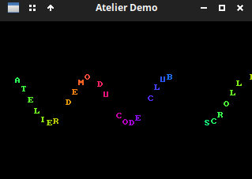

## 6. Champ d’étoiles (starfield)

Il s’agit d’un effet typique très populaire dans les années 80s/début 90 car il permet très simplement avec un minimum de calculs d’obtenir un effet assez impressionnant (effet 3D) qui simule le voyage à travers l'espace. Des points lumineux partent du centre de l'écran et se déplacent vers les bords, s'accélérant à mesure qu'ils "s'approchent" de l'observateur. La beauté de cet effet est qu'il repose sur une seule idée : **la perspective**. Plus une étoile est "loin" (profondeur élevée), plus elle est proche du centre et se déplace lentement. Plus elle est "proche" (profondeur faible), plus elle est éloignée du centre et se déplace vite.

Alors, comment simule-t-on un rendu 3D ? On verra plus tard comment réaliser des effets 3D complexes sur des formes géométriques (avec rotation, etc.) à l’aide du calcul matriciel et la trigonométrie, mais ici rien de tout cela, on va s’en sortir avec de simples multiplications et divisions (en réalité un bête produit en croix, comme au marché pour calculer le prix de 2 kilo de tomates). En fait on va obtenir cet effet avec une simple application du théorème de Thalès (celui vu en cours de math au collège) dans le cas particulier d’une projection perspective. 

### Projection avec le théorème de Thalès

Voyons avec un schéma comment le problème se présente :

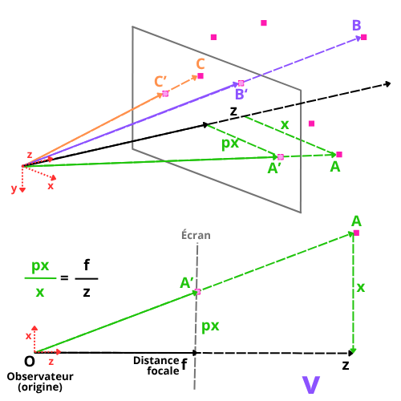

Si on imagine avoir des étoiles (en fait juste des points / pixels) dans l’espace, de coordonnées (x, y, z), tout le problème consiste à déterminer la position (px, py) correspondante sur l’écran en deux dimensions pour chacune d’entre elle. Le problème est géométriquement très simple pour peu qu’on considère que l’observateur regarde selon un axe fixe qui traverse l’écran (le plus simple est d’imaginer un axe qui passe au milieu de l’écran et perpendiculaire à celui-ci, mais ce n’est pas obligatoire), on appellera distance focale *f* la distance entre l’observateur et l’écran. 

Par exemple, si pour simplifier le raisonnement encore, on ne considère que la position x et z du point A (pour lequel y = 0), une application directe du thèorème de Thalès nous donne : 
$$
\frac{px}{x} = \frac{f}{z}
$$
 D’où, si on veut déterminer la position *px* sur l’écran, il suffit de calculer :
$$
px = \frac{f·x}{z}
$$

Il en va bien sûr de même pour le calcul de *py*. 

Pour créer un effet de champ d’étoile basique, il suffira :

1. Générer aléatoirement les coordonnées en 3 dimensions (x, y, z) d’un  certaine nombre d’étoiles
2. Fixer la distance focale *f*
3. Calculer la projection (px, py) de chaque étoile sur l’écran à partir de la formule ci-dessus et de leurs coorodnnées (x, y, z)
4. Afficher les étoiles projetées

> Pour une définition rigoureuse des paramètres : chaque étoile est définie par trois coordonnées : `(x, y, z)` en 3D. `x` et `y` sont les même axes de  coordonnées que sur l’écran, `z` est la profondeur (la distance à l'observateur). L'écran est à `z = 0`, et l'espace s'étend vers des `z` croissants.
>
> La distance focale aura pour effet de définir également l’angle de vue. Il est facile d’imaginer que plus l’observateur est éloigné de l’écran (= grande distance focale), plus l’angle de vue va être réduit (les angles entre les directions des étoiles vues à travers l’écran et l’axe z confondu avec la direction du regard de l’observateur), et au contraire que plus il s’approche de l’écran, plus l’angle de vision à travers l’écran est important. Une valeur typique pour cette distance est LARGEUR/2 ce qui donne un angle autour de 90°.

Pour rester efficace à l’étape 1, il vaut mieux générer les étoiles dans un espace limité propice à l’observation : inutile de générer des étoiles derrière l’observateur où dans des zones dont il est peu probable que la projection finisse sur l’écran, qui n’est pas un plan infini. On va par exemple les générer dans les limites d’un parallélépipède dont une base est quatre fois plus grande que l’écran, mais qui peut être assez profond, le jeu étant de donner l’impression de traverser ce champ d’étoile. Ce qui nous amène au deuxième aspect de cet effet : l’animation.

 ### Animation

Tout l’intérêt de l’effet réside dans le défilement des étoiles qui donne l’impression subjective de déplacement au travers du champ d’étoile. Ce défilement va être obtenu en diminuant la position z des étoiles pour les rapprocher de l’observateur. 

#### Accélération

Pour amplifier cet effet de défilement, les étoiles éloignées apparaissant par projection plus près du centre et les étoiles proche plus près des bords, on va accélérer le défilement plus les étoiles s’approchent du centre (les étoiles éloignées proches du centre s’approcheront nettement plus lentement).

Décrémenter z de cette façon fait qu’au bout d’un moment il vaudra 0 (ou deviendra négatif) pour certaines étoiles : elles auront dépassé l’observateur. Afin que l’effet soit infini et qu’il y ait toujours des étoiles à afficher, il conviendra à ce moment de réinitialiser la coordonnée `z` de ces étoiles à une profondeur aléatoire.

#### Luminosité et traînée

Une autre matière d’amplifier l’effet de profondeur est de, comme dans la réalité, afficher les étoiles avec une luminosité qui dépend de leur distance : les étoiles les plus lointaines sont moins lumineuses, et cette luminosité va augmenter au fur et à mesure qu’elles se rapprochent.

Un autre effet sympa est de rajouter une petite traînée (une rémanence de la luminosité à l’ancienne position de l’étoile), et pour cela il faut prévoir de mémoriser l’ancienne position de l’étoile. On verra cette effet plus en détail dans la section suivante sur les améliorations que l’on peut apporter à un champ d’étoiles basique (variation de la vitesse, déplacement de la ligne de fuite, variation de la taille des étoiles, coloration des étoiles…)

### Implémentation

Nos étoiles, même s’il s’agit de simples pixels seront traitées comme des sprites, il est donc intéressant de créer une structure spécifique `Etoile` qui contiendra les 3 coordonnées en 3D et l’ancienne profondeur.

Suivant la technique du « sprites pool » on va avoir une fonction `init_etoile()` qui va servir de générateur pour une liste d’étoiles. La suite ne pose pas de difficulté : on va parcourir la liste d’étoile, pour chacune d’entre elle :

- mettre à jour la profondeur
- calculer la position (projection) sur l’écran avec les formules ci-dessus impliquant cette profondeur,
- vérifier si l’étoile apparaît toujours sur l’écran, si non on réinitialise sa profondeur
- mettre à jour la luminosité de l’étoile
- l’afficher

Voilà le code source pour cet effet :

**`effects/starfield.h`**

```c 
#ifndef STARFIELD_H
#define STARFIELD_H

#include <MiniFB.h>
#include <stdint.h>

void run_starfield(struct mfb_window *win, uint32_t *buffer);

#endif
```

**`effects/starfield.c`**

```c
#include "starfield.h"
#include <MiniFB.h>
#include <stdlib.h>
#include <string.h>
#include <math.h>
#include "utils/primitives.h"
#include "config.h"

#define NB_ETOILES 200
#define FOCAL      160.0f   // distance focale en pixels on pourrait écrire LARGEUR/2

// Structure d'une étoile : position 3D et profondeur au frame précédent.
// z_prev permettra de calculer différent effets :
// la taille de l'étoile en fonction de sa vitesse apparente 
// traînée, etc. (pas implémenté tout de suite).
typedef struct {
    float x, y, z;
    float z_prev;
} Etoile;

// Liste des étoiles (sprites pool)
// static : invisible en dehors de ce fichier, pas de collision de noms
// si d’autre fichier utilisent une liste similaire 
// (ce sera le cas pour les effets starfield avancés)
static Etoile etoiles[NB_ETOILES];

// Initialise une étoile (générateur) à une position aléatoire dans le volume 3D
static void init_etoile(Etoile *e) {
    e->x = (float)(rand() % LARGEUR) - LARGEUR / 2.0f;
    e->y = (float)(rand() % HAUTEUR) - HAUTEUR / 2.0f;
    e->z = (float)(rand() % 256) + 1.0f;  // profondeur 1..256, jamais 0
    e->z_prev = e->z;
}

void run_starfield(struct mfb_window *win, uint32_t *buffer) {

    // srand(42) garantit que le champ d'étoiles est identique à chaque
    // lancement. C’est utile pour le débogage. Remplacer par srand(time(NULL))
    srand(42);
    for (int i = 0; i < NB_ETOILES; i++)
        init_etoile(&etoiles[i]);

    // vitesse : diminution profondeur / seconde.
    float vitesse = 20.0f;

    struct mfb_timer *chrono = mfb_timer_create();

    while (mfb_wait_sync(win)) {
        double dt = mfb_timer_delta(chrono);

        memset(buffer, 0, LARGEUR * HAUTEUR * sizeof(uint32_t));

        for (int i = 0; i < NB_ETOILES; i++) {
            Etoile *e = &etoiles[i];

            // On sauvegarde z 
            e->z_prev = e->z;

            // Réduction de la profondeur : l'étoile se rapproche de l'observateur.
            // L'accélération progressive (e->z * 0.01f * vitesse) crée 
            // une accélération exponentielle :
            // plus l'étoile est proche, plus elle avance vite.
            e->z -= (vitesse + e->z * 0.01f * vitesse) * (float)dt;

            // L'étoile a dépassé l'observateur : réinitialisation de z
            if (e->z <= 0) {
                init_etoile(e);
                continue;
            }

            // Projection perspective (Thalès) :
            //   px = x * f / z   (+ LARGEUR/2 pour centrer sur l'écran)
            //   py = y * f / z   (+ HAUTEUR/2 pour centrer sur l'écran)
            int px = (int)(e->x * FOCAL / e->z) + LARGEUR / 2;
            int py = (int)(e->y * FOCAL / e->z) + HAUTEUR / 2;

            // L'étoile est sortie de l'écran : on la réinitialise.
            if (px < 0 || px >= LARGEUR || py < 0 || py >= HAUTEUR) {
                init_etoile(e);
                continue;
            }

            // Luminosité inversement proportionnelle à la profondeur :
            // loin (z=256) → lum=0
            //  proche (z=0) → lum=255 
            uint8_t lum = (uint8_t)(255.0f * (1.0f - e->z / 256.0f));
            plot(buffer, px, py, MFB_RGB(lum, lum, lum));
        }

        mfb_update_state etat = mfb_update_ex(win, buffer, LARGEUR, HAUTEUR);
        if (etat != MFB_STATE_OK) break;
    }

    mfb_timer_destroy(chrono);
}
```

> Ne pas oublier d’inclure le header et de d’appeler `run_starfield()` dans `main.c` et de mettre à jour `CMakeLists.txt`!

Vous devriez obtenir cela :

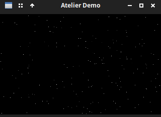

## 7. Effet 3 : champ d’étoile avancé

### Enrichissements

Notre champ d’étoile crée un vrai effet de profondeur, mais il est un peu ennuyeux. L’intérêt d’une démo est d’aller plus loin en inventant des effets un peu plus impressionnant (c’est la raison d’être des démo : surprendre avec de l’inventitivité et des prouesse technqieus). Parmi ces améliorations ont peut suggérer : vitesse variable, rotation du point de fuite, couleurs, traînées. Le meiux quand on construit un effet est d’impélémenter un effet basique, qui montre qu’on comprend le principe et son implémentation, puis de l’enrichir petit à petit, couche après couche. Cette section montre comment paramétrer l'effet de façon interactive et ajouter d’autres couches visuelles. Charge à vous d’en inventer d’autres !

### Contrôle de la vitesse et de la direction

Ajoutez un contrôle clavier pour faire varier la vitesse en temps réel. La vitesse peut même devenir négative (marche arrière), ce qui donne l'impression de reculer dans l'espace.

```c
// Dans la boucle, avant la mise à jour des étoiles :
const uint8_t *touches = mfb_get_key_buffer(win);
if (touches[MFB_KB_KEY_UP])    vitesse += 50.0f * (float)dt;
if (touches[MFB_KB_KEY_DOWN])  vitesse -= 50.0f * (float)dt;
// On plafonne, on bride pour éviter les valeurs extrêmes
if (vitesse >  500.0f) vitesse =  500.0f;
if (vitesse < -500.0f) vitesse = -500.0f;
```

> **À vous de jouer : correction du cadre d'apparition en vitesse négative**
>
> Observez attentivement ce qui se passe quand vous passez en vitesse négative : les étoiles semblent apparaître dans une zone plus petite que l'écran, laissant les bords vides. Pourquoi ?
>
> Rappelez-vous la formule de projection : `px = x * FOCAL / z + LARGEUR/2`. La position `x` d'une étoile est initialisée aléatoirement dans `[-LARGEUR/2, LARGEUR/2]`, et sa profondeur `z` dans `[1, 256]`. À grande profondeur, même une étoile à `x = LARGEUR/2` se projette près du centre car `FOCAL/z` est petit. En vitesse normale, cela ne pose pas de problème car les étoiles partent de loin et grossissent vers les bords. En vitesse négative, les étoiles sont censées partir de près (`z` petit) et s'éloigner, or elles sont réinitialisées à grande profondeur (ce qu’on a défini par défaut car l’effet de base est de rapprocher lse étoiles et là on fait l’inverse) et n'atteignent jamais les bords de l'écran. Dans cette nouvelle situation, leur point de départ est projeté près du centre (car comme nous venons de le dire `z` est grand)et ensuite elles fuient vers ce centre. Comment résoudriez-vous ce problème ?
>
> **Piste de résolution** : introduisez une constante `Z_INIT_MAX` qui contrôle la profondeur max d'apparition des étoiles quand, et une constante `Z_INIT_MIN` pour la profondeur minimale. Vous utiliserez ces constantes pour ajuster la profondeur d’apparition des étoiles en fontion de la situation. En vitesse négative, initialisez `z` dans `[Z_INIT_MIN, Z_INIT_MIN + delta]` de manière à ce que les étoiles apparaissent dans un intervalle `delta`  près de l'observateur, et ajustez en conséquence la plage de `x` et `y` pour couvrir tout l'écran à cette profondeur. La formule inverse de la projection vous donnera la plage de `x` nécessaire pour atteindre les bords : `x_max = (LARGEUR/2) * z / FOCAL`.

### Déplacement du centre de convergence

Le point de convergence des étoiles (leur origine perçue) ou point de fuite de la perspective (même si les étoiles en proviennent plutôt qu‘y fuir) peut se déplacer sur l'écran, simulant un changement de cap. On paramétrise `cx` et `cy` (le centre de projection) et on modifie ces positions de manière cyclique selon une courbe sinus juste avant de calculer la projection :

```c
double t = mfb_timer_now(chrono);
float cx = LARGEUR  / 2.0f + 60.0f * sinf((float)t * 0.4f);
float cy = HAUTEUR / 2.0f + 40.0f * sinf((float)t * 0.3f);

// Dans la projection :
int px = (int)(e->x * FOCAL / e->z) + (int)cx;
int py = (int)(e->y * FOCAL / e->z) + (int)cy;
```

Bien sûr vous pouvez faire en sorte que la direction de ce centre de suite soit impacté par l’appuie d’une touche plutôt qu’une ocscillation automatique (par exemple l’appui sur les flèches gauche et droite jouent sur des variables `dx` et `dy` qui décalent le centre de fuite).

### Traînées et taille variable

Une étoile proche doit apparaître plus grande qu'une étoile lointaine. Pour cela, on peut dessiner un pixel plus grand (un petit carré 2×2 ou 3×3) selon la profondeur. 

On peut aussi tracer une ligne entre la position de l'étoile au frame précédent et sa position actuelle, ce qui crée des traînes caractéristiques des animations de vitesse maximale.

```c
// Taille proportionnelle à la proximité
int taille = (int)(8.0f * (1.0f - e->z / 256.0f)) + 1;
for (int dy = -taille/2; dy <= taille/2; dy++)
    for (int dx = -taille/2; dx <= taille/2; dx++)
        plot(buffer, px + dx, py + dy, MFB_RGB(lum, lum, lum));

// Traînée (position précédente → position actuelle)
int px_prev = (int)(e->x * FOCAL / e->z_prev) + (int)cx;
int py_prev = (int)(e->y * FOCAL / e->z_prev) + (int)cy;
dessiner_ligne(buffer, px_prev, py_prev, px, py, MFB_RGB(lum/2, lum/2, lum));
```

> Il faut insérer ces bouts de code après le calcul de la projection et les tests de sortie d'écran, et à la place de l'appel à `plot` de la version précédente. À ce stade, on sait que l'étoile est visible et on connaît ses coordonnées écran `px`, `py` ainsi que sa profondeur actuelle `e->z` et sa profondeur précédente `e->z_prev`. Il faut aussi avoir calculé la luminosité `lum` avant.
>
> Avec les paramètres choisis (notamment le `8.0f` ), l’effet est grossier (gros carrés pour les étoiles), mais c’est pour mieux faire comprendre comment il fonctionne, à vous de trouver la valeur de paramètre qui mette suffisamment en valeur l’effet tout en ne donnant pas l’impression d’une résolution dégueulasse.
>
> Par ailleurs vous voyez qu’on dessine la traînée avec `dessiner_ligne()` il faut donc bien penser à inclure `primitives.h` pour accéder à cette fonction. Vous comprenez aussi pourquoi on a commencé à créer cette boîte à outil « primitives » : afin de disposer des outils plus tards. Par ailleurs la variation de profondeur `z` d’une frame à l’autre est très faibles à petite vitesse, donc cet effet traîné n’apparaît qu’aux hautes vitesse où l’écart de profondeur devient plus important. Pour avoir des traînées plus longues, il faut soit mémoriser la position plusieurs frames à l’avance (ce qui peut être compliqué), soit tricher un peu sur le plan physique en simulant un `z_prev` beaucoup plus grand pour provoquer un écart plus important. On ne fait pas une simulation astrophysique réaliste mais une démo où c’est l’effet qui compte : on peut tricher si c’est pour la cause ! Enfin combiner effet de traînée et taille n’est pas une bonne idée si on trace la traînée avec une ligne d’un pixel de large alors que l’étoile est plus grosse (adaptez le code dans ce cas !)
>
> Enfin cumuler les deux effets peut leur nuire, vous pouvez très bien programmer le passage d’un effet à l’autre par l’appuie sur une touche (`t` pour traînées/taille par exemple).

### Étoiles colorées par couche

Organisez les étoiles en couches (close, mid, far) avec des couleurs différentes. Les étoiles proches sont blanches-jaunâtres, les intermédiaires bleues, les lointaines violettes, cela renforce la sensation de profondeur.

```c
uint32_t couleur;
if      (e->z < 80)  couleur = MFB_RGB(lum, lum, (uint8_t)(lum * 0.8f));      // blanc-jaune
else if (e->z < 160) couleur = MFB_RGB((uint8_t)(lum*0.6f), (uint8_t)(lum*0.8f), lum); // bleu
else                  couleur = MFB_RGB((uint8_t)(lum*0.8f), (uint8_t)(lum*0.4f), lum); // violet
// plot(buffer, px, py, couleur); affichage à adapter en fonction des autres effets sélectionnés
```

> Là aussi l’effet est grossier pour le rendre visible et l’expliquer, vous pouvez très bien l’affiner en choisissant une progression de couleur plus progressive, en ajoutant des catégories de profondeur, etc.

Il ne s’agit que de quelques suggesgtions, vous pouvez en chercher d’autres ou améliorer encore plus ces effets. N’oubliez pas qu’en la matière, plus on en fait, mieux c’est. L’effet doit rester lisible mais on n’est pas non plus dans l’économie, on doit en mettre plein la vue : pimp your demo !

Un exemple de ce que vous pouvez obtenir :

Avec un effet de trainées et un étagement des couleurs :

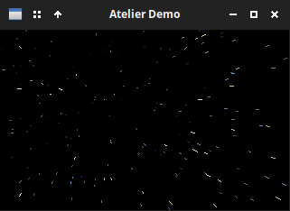

Et si on joue sur la taille des étoiles :

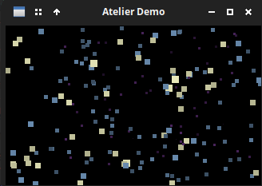

> On remarque que l’on peut se retrouver avec des « petites étoiles » (donc des étoiles plus éloignée) dessinées devant des « grosses étoiles » plus proches. C’est parce qu’on dessine les étoiles dans l’ordre où elles apparaissent dans le buffer, et non pas en fonction de leur profondeur (dessiner les étoiles éloignées d’abord et les étoiles plus proches en dernier). Est-il possible de modifier notre code dans ce sens ? À vous de jouer !

Enfin on voit que si on combine notre implémentation des effets taille et traînées en même temps ça ne marche pas bien (les traînées restent de petites lignes fines), adaptez donc notre implémentation de cet effet traînée pour que la combinaison fonctionne ! 

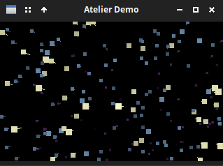

## 8. Effet 4 : Palette cycling

C’est un effet typique des machines 8 et 16 bits qui affichaient peu de couleur (de la Gameboy 4 couleurs à l’Amiga, Super Nes en etc. en 256 couleurs), qui reposent essentiellement sur une gestion hardware de ces palettes. Cela permettait sans faire vraiment de calcul de créer des effets d’animation (p. ex. lave, eau…) en modifiant juste les couleurs d’une image fixe. Avec le passage aux couleurs 32bits (16 millions de couleur) ça n’a plus vraiment de sens, mais c’est une effet typique qui peut être facilement simulé si on tient à une DA « démo » ou « rétro ».

Pour émuler parfaitement l'effet il suffit de définir un tableau de couleurs (notre "palette"), on peint les pixels en référence aux indices dans cette palette/tableau, et on fait tourner les indices à chaque frame.

On va utilse trois tables :

- un **tableau de correspondance** qui indique pour chaque pixel du buffer l’indice correspondant dans la palette. Pour obtenir des effets graphiques, on va organiser spatialement la répartition des indices avec des fonctions mathématiques qui pourront créer des motifs (cercles concentriques, oscillations, etc.), comme le montre l’illustration ci-dessous :

  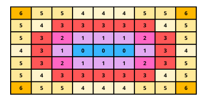

  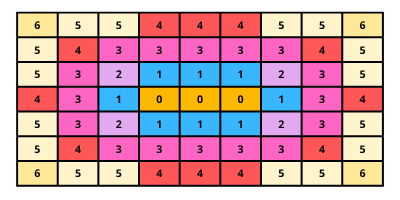

  > On voit ici qu’il suffit de changer la couleur associé à chaque indice pour créer un effet graphique. Cette association indice/couleur est réalisée par la palette, présentée ci-dessous

- la **palette** proprement dite, une liste de longueur 256 où chaque indice pointe vers une couleur. C’est cette correspondance indice/couleur qu’on va modifier à chaque frame pour avoir ce fameux effet « cycling ». 

- notre **buffer** où on associe la bonne couleur 32bits à chaque pixel à partir de l’indice lu dans le tableau de correspondance pour afficher l’image obtenue.

On va donc déclarer :

```c
// notre tableau de correspondance pixels/indices (motifs) qui vont de 0 à 256
uint8_t *indices = malloc(LARGEUR * HAUTEUR * sizeof(uint8_t)); 

// nos 256 couleurs 32bits de notre palette, chacune stockée à un indice donné
uint32_t *palette = malloc(256 * sizeof(uint32_t));

// notre buffer d’affichange classique - déclaré dans main.c
uint32_t *buffer = malloc(LARGEUR * HAUTEUR * sizeof(uint32_t)); 
```

### Générer le tableau de motif d'indices

Le motif peut être n'importe quelle fonction mathématique. Un classique assez simple (notre exemple ci-dessus) : calculer pour chaque pixel sa distance au centre, modulo 256. Cela crée des anneaux concentriques.

```c
// Initialisation unique du buffer d'indices
for (int y = 0; y < HAUTEUR; y++) {
    for (int x = 0; x < LARGEUR; x++) {
        float dx = x - LARGEUR / 2.0f;
        float dy = y - HAUTEUR / 2.0f;
        float dist = sqrtf(dx*dx + dy*dy);
        indices[y * LARGEUR + x] = (uint8_t)((int)dist % 256);
    }
}
```

Autres motifs intéressants à combiner (n’hésitez pas à tester) :

- **Ondulation** : `(int)(sinf(x * 0.2f) * 40 + sinf(y * 0.15f) * 40) & 255`
- **Diagonal** : `(x + y) & 255`
- **XOR** : `(x ^ y) & 255`

### Générer la palette

Contrairement à ce qu’on pourrait penser, on ne va pas générer la palette n’importe comment en associant au hasard un ensemble de couleurs qui nous plaît avec les indices possibles. Notre objectif est de décaler les indices des couleurs pour créer quelque chose de joli, on va donc structurer un peu la manière dont on construit la palette. 

Notre palette est un tableau de 256 couleurs qui devra former un **cycle continu** : la couleur 255 doit être visuellement proche de la couleur 0, pour que la rotation de la palette soit fluide et sans saut visible. C'est la contrainte principale : une palette pour le cycling n'est pas un dégradé linéaire du noir au blanc (qui passerait alors brutalement du noir au blanc quand on fait le tour), c'est une boucle fermée sans « saut » entre teinte.

Il existe deux façons classiques de construire cette boucle :

**Approche HSV** : il y a plusieurs espace colorimétrique pour représenter les couleurs. On a manipulé jusqu’ici le très populaire RGB (combinaison linéaire de trois couleurs primaires), mais il en existe d’autre, dont un qui est très pratique pour boucler sur les couleurs car il est organisé comme un cycle : le **HSV** (*Hue, Saturation, Value* ou *Teinte, Saturation, Lumière* en français). Allez voir les schémas sur [l’article Wikipedia correspondant](https://fr.wikipedia.org/wiki/Teinte_saturation_lumi%C3%A8re), vous comprendrez tout de suite comment les couleurs sont organisées en cercles. Une couleur est définie par trois composante, dont la première est la teinte, représentée sur un cercle analogue au fameux [cercle chromatique](https://fr.wikipedia.org/wiki/Cercle_chromatique), ce qui permet d’associer un angle donné à une teinte : 0° pour le rouge, 60° pour le jaune, 120° pour le vert, etc. La deuxième composante est la saturation ou pureté de la couleur, quantifiée de 0 à 1 ou de 0% à 100% : un rouge à 100% sera un rouge très saturé, « pur ». Une couleur sans saturation sera en fait blanche. Enfin vient la luminosité : à quel point la couleur est sombre : à 0% toutes les couleurs virent au noir (aucune luminosité). 

Cette approche est pratique pour créer une palette circulaire : on parcourt le cercle des teintes de 0° à 360° en 256 pas, à saturation et valeur constantes. On obtiendra une roue chromatique : rouge, orange, jaune, vert, cyan, bleu, magenta, puis retour au rouge. La boucle est naturellement fermée puisque 360° = 0°. Le défaut : toutes les couleurs ont la même luminosité, le résultat est très saturé et peu nuancé. De plus, pour l’affichage, il faudra convertir le HSV en RGB (mais il existe des formules connues pour cela, cf. l’article wikipedia).

**Approche par sinus déphasés** : c'est une méthode plus complexe et élaborée, et qui a aussi une familiarité avec l’utilisation du cercle chromatique, mais aux résultats plus nuancés. C’est celle que nous allons implémenter. Chaque canal RGB est un sinus de l'indice `i`, avec un déphasage différent entre les canaux :

```c
r = 128 + 127 * sin(i * 2π/256)
g = 128 + 127 * sin(i * 2π/256 + 2π/3)   // déphasage de 120°
b = 128 + 127 * sin(i * 2π/256 + 4π/3)   // déphasage de 240°
```

Chaque canal oscille entre 0 et 255. Les trois sinus sont déphasés de **120° (soit 2π/3 radians)** l'un par rapport à l'autre, comme les trois composantes d'une roue chromatique (rouge = 0°, vert = 120° et bleu = 240°). Quand rouge est au maximum, vert et bleu sont à des valeurs intermédiaires décalées, ce qui produit une succession de teintes : rouge → jaune → vert → cyan → bleu → magenta → rouge. La boucle est fermée car le sinus est lui-même une fonction périodique, c’est-à-dire qu’à `i=256` on retrouve exactement la même valeur qu'à `i=0`.

L'avantage sur HSV : en jouant sur les fréquences (multiplier l'argument par 2 ou 3) et sur les amplitudes, on peut créer des palettes très différentes qui pourront évoquer différents éléments : flammes, océan, néon, etc., le tout avec la même structure mathématique.

```c
void generer_palette(uint32_t *pal) {
    for (int i = 0; i < 256; i++) {
        float t = i / 256.0f;
        uint8_t r = (uint8_t)(128 + 127 * sinf(t * 6.28f));
        uint8_t g = (uint8_t)(128 + 127 * sinf(t * 6.28f + 2.09f));  // décalage 2π/3
        uint8_t b = (uint8_t)(128 + 127 * sinf(t * 6.28f + 4.19f));  // décalage 4π/3
        pal[i] = MFB_RGB(r, g, b);
    }
}
```

### Rotation de la palette

Par rapport à ce que nous avions annoncé concernant cette méthode, la seule chose qui reste à faire est de réaliser un cycle sur la palette (palette cycling). La rotation va tout simplement consister à décaler un offset de lecture sur les indices de la palette. Au lieu de modifier la palette elle-même, on ajoute un décalage entier à chaque indice lors de la reconstruction du buffer d'affichage :

```c
int offset = (int)(t * 60) % 256;  // 60 entrées de palette par seconde

for (int i = 0; i < LARGEUR * HAUTEUR; i++) {
    int idx = (indices[i] + offset) & 255;  // & 255 = modulo 256, rapide
    buffer[i] = palette[idx];
}
```

C'est aussi simple que ça : pas de recalcul du motif, juste une addition et un masquage par pixel (qui réalise un modulo).

Implémentez l’effet (ici c’est tellement simple qu’il nous semble inutile de donner le code final). Vous devriez obtenir quelque chose comme ça pour l’effet le plus simple (cercles concentriques), avec une variation cyclique des couleurs :

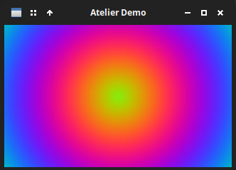


> Pour aller plus loin : expérimentez différents déphasages de couleurs, différents motifs (différentes fonctions, vous pouvez combiner des fonctions entres elles : p. ex. ajoutez une sinusoïde à la fonction distance des cercles concentriques). Essayez aussi d’implémenter la méthode HSV pour la rotation de palette.

## 9. Effet 5 : Tunnel

L’effet tunnel est de la même famille que le champ d’étoile : donner l’impression subjective de foncer dans un environnement 3D, ici un tunnel. La différence est que l’intérieur du tunnel est « plein/opaque » (texturé) et qu’on va obtenir l’effet en déformant une image 2D (une texture) pour rendre l’effet de perspective. Avec les ordinateurs modernes on pourrait très bien produire cet effet avec un modèle 3D du tube sans difficulté, mais dans cet atelier nous adoptons l’approche rétro historique. Voyons donc plutôt comment obtenir cet effet avec le minimum de ressources (ce genre d’effet tournait sur des machines 16bits, voire 8bits).  C’est un effet très facile à programmer, mais les mathématiques (ou la géométrie) derrière cet effet sont un peu délicates à expliquer.

L’astuce va être de précalculer les déformations appliquées à la texture pour ne pas avoir à les calculer en temps réel, à la volée, sur une machine qui calcule trop lentement pour avoir une animation fluide (les calculs doivent impérativement avoir lieu entre deux rafraîchissements). Notre problème est de déterminer quelle partie de notre texture (on appelle ces éléments des [texels]()) va être affichée à la position de chaque pixel de notre buffer, en prenant en compte la perspective.

Cette perspective (qu’il faut appréhender ici comme une fonction qui va provoquer une déformation) dépend de deux grandeurs physiques : la distance du pixel considéré au centre et l’angle vers le centre, ce centre constituant l’origine de notre repère. Ce sont ces deux grandeurs qu’on va précalculer, on va donc créer une table `distance` et une table `angle`. C’est en interrogeant pour chaque pixel du buffer ces tables que notre fonction `run_tunnel()` va pouvoir déterminer quel texel dessiner sur chaque pixel.

Pour obtenir une animation, de manière analogue à ce qu’on a souvent vu précédemment, c’est en appliquant un offset sur ces tables que l’on va « déplacer » à l’écran les éléments du tunnel en faisant le minimum de calcul. De manière tout à fait intuitive, un offset sur la table `angle` va provoquer une rotation (on va décaler l’angle de tous les texels), et un offset sur la table `distance` va provoquer un décalage ou déplacement (on va déclaer la distance de tous les texels).

Tout ceci peut paraître très abstrait dit avec des mots, ce sera sûrement plus clair avec une représentation géométrique, puis le formalisme mathématique, objet de la section suivante.

### Modèle mathématique

#### Géométrie

Nous disposons d’une texture en 2D, de forme rectangulaire ou carrée. Pour la plaquer sur un tunnel, on doit trouver une transformation géométrique qui la replie en un cylindre, puis la projette sur un plan (l’écran), perpendiculaire à l’axe du cylindre et centré sur cet axe :

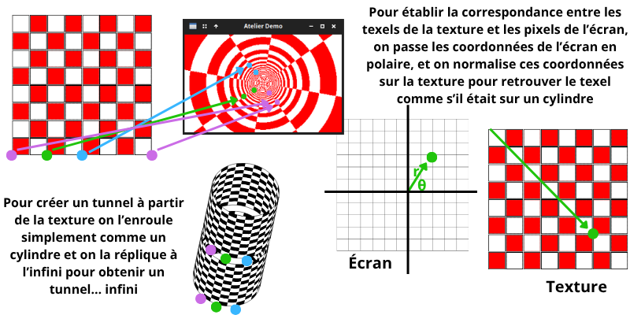

On a repéré sur cette illustration quelques points (disques de couleur) pour qu’on voit la correspondance entre la texture 2D / le cylindre / la projection sur l’écran. Notre objectif n’est pas de faire de la « vraie 3D », mais de trouver un moyen économique d’obtenir le même résultat avec une déformation de la texture, en trouvant comment faire correspondre la position d’un texel sur la texture et celle d’un pixel sur l’écran, « comme si c’était de la 3D ».

Sur le schéma on indique que pour retrouver le texel correspondant à un pixel donné de l’écran, on « normalise les coordonnées polaires du pixel sur la texture ». Pour mieux comprendre la transformation que ça décrit, on est obligé de passer par les formules mathématiques.

#### Formules

Comme on s’intéresser à la position des points sur un cylindre avec un centre de fuite, on comprend intuitivement l’intérêt de passer en coordonnées polaires pour repérer la position des points. Pour chaque pixel de l'écran de coordonnées `(x, y)` (centrées à l'origine), on calcule :

```
angle    = atan2(y, x)                   → coordonnée U dans la texture [0, 2π]
distance = longueur_tunnel / sqrt(x²+y²) → coordonnée V (profondeur dans le tunnel) autrement dit L/r
```

> Pour déterminer l’angle vers le centre, on va utiliser la fameuse fonction  `atan2()`. Si vous ne la connaissez pas voici [une explication dans cet autre atelier](https://github.com/aucoindujeu/codeclub/tree/main/pygame/boids#annexe--orientation-et-trigonom%C3%A9trie) car elle est très importante dès qu’on doit déterminer un angle entre deux points (très utile dans la programmation de jeux vidéo, la simulation ou encore la programmation graphique comme ici).
>
> Pour la distance, on calcule en fait l’inverse de la distance au centre : on obtiendra une très grande valeur pou les pixels proche du centre (qui seront donc rendus comme très éloignés), et une petite valeur pour les pixels du bord de l’écran (c.-à-d. loin du centre), participant à créer l’effet de profondeur.

Par convention quand on réalise une transformation de texture, on utilise `x` et `y` pour désigner les coordonnées ou les dimensions des vecteurs sur la texture, et `u` et `v` pour le résultat de la transformation :

- ici la coordonnée U correspond à la position angulaire autour du tunnel (0 = droite, π = gauche, 2π = retour). 

- et la coordonnée V correspond à la position en profondeur le long du tube .

Jusqu’ici on comprend à peu près, vu qu’on manipule un cylindre vu du dessus, pourquoi on cherche à trouver un angle et une distance. Mais le point essentiel est qu’ensuite on va « normaliser » ces valeurs dans le repère de la texture. Cela mérite un peu plus d’explications.

La texture n'est **pas** lue depuis son centre (contrairement au repère qu’on a placé au centre de l’écran, vu que ce sera le point de fuite), elle est lue depuis son coin supérieur gauche *comme toute image*, avec U dans l’intervalle`[0, TEX_W[` et V dans `[0, TEX_H[` (les dimensions de la texture sont `TEX_W × TEX_H`). Le "bon repère" sur la texture est donc toujours rectangulaire, pas polaire.

Ce qui se passe c'est que `atan2` retourne un angle dans `[-π, π]` donc on le normalise ensuite en un entier dans `[0, TEX_W[`  pour justement retrouver une coordonnée dans  `[0, TEX_W[` (la dimension de la texture) à partir d’un angle :

```c
table_u[...] = (int)(atan2(fy, fx) / M_PI * TEX_W / 2.0f + TEX_W) % TEX_W;
```

Et `L/r` donne une valeur qui peut aller jusqu’à l’infini qu'on va normaliser en `[0, TEX_H[` :

```c
table_v[...] = (int)(longueur / r * TEX_H) % TEX_H;
```

Donc la transformation complète est :

```
coordonnées écran (x, y)  →  polaires (θ, r)  →  texel (U, V) dans [0, TEX_W[ × [0, TEX_H[
```

La texture est lue comme une **carte rectangulaire du cylindre**, exactement comme une carte du monde rectangulaire qui représente une sphère. L'axe horizontal U représente le tour complet du tunnel (0° à 360°), l'axe vertical V représente la profondeur. La texture carrée est donc "enroulée" autour du cylindre du tunnel et son bord gauche rejoint son bord droit (U=0 et U=TEX_W correspondent au même endroit angulaire, ce qui correspond aux points violets sur le schéma au-dessus). Cela explique pourquoi le damier semble continu sans couture visible dans notre effet.

C'est ce qu'on appelle un **dépliage UV** (UV unwrapping), une technique courante en 3D : on projette une surface 3D sur un plan 2D pour pouvoir lui appliquer une texture rectangulaire. Ici on fait exactement ça, **mais à l'envers** (ce qui rend l’explication contre-intuitive) : on part de l'écran 2D et on calcule pour chaque pixel où il "tombe" sur la texture dépliée du cylindre.

> Pour aller un peu plus loin dans l’explication si vous n’êtes pas encore perdu. Tout le « sel » de l’effet est dans la non-linéarité de la transformation : on voit que plus on s’approche du centre et plus la texture est « écrasée » ou compressée, alors que sur les bords elle est plutôt « expansée », ce qui contribue à l’effet de perspective. Deux exemples de calculs pour s’en rendre compte, avec le calcul de nos distances (V = L/r) :
>
> - Deux pixels très proches du centre (r=1 et r=2) : leurs V valent L/1 et L/2 soit une différence de L/2 entre les deux, soit un rapport de 1 à 2
> - Deux pixels loin du centre (r=80 et r=81) : leurs V valent L/80 et L/81, cette fois la différence est de L/6480, ce qui est une valeur minuscule
>
> Donc des pixels très proches sur l'écran près du centre correspondent à des points très éloignés dans la texture (beaucoup de texture est "compressée" vers le centre, c’est ça qui est contre-intuitif : on trouve une grande valeur ce qui correspond à une réduction de la texture). Et des pixels très espacés sur les bords correspondent à des points très proches dans la texture.

Revenons à notre effet et notamment l'animation. On ne cherche pas juste à créer une image fixe, on veut que ça bouge (= évolution dans le temps). Donc on ajoute un décalage temporel (fonction du temps) à chaque coordonnée :

- Décalage sur U : induit une `rotation` du tunnel sur lui-même
- Décalage sur V : induit un  `avancement`  (déplacement) dans le tunnel

```c
u_texel = (int)((angle  / π) * TEX_W / 2 + rotation  * t) mod TEX_W
v_texel = (int)(distance                  + avancement * t) mod TEX_H
```

> TEX_W et TEX_H sont les dimension de notre texture, qui a une dimension finie, alors que la distance que l’on calcule peut aller jusqu’à l’infini (fonction inverse). Donc on prend le modulo de cette distance par les dimension de la texture, de manière  à ce que si on a une distance calculée pour un pixel dépasse les dimensions de la texture, on retombe à l’intérieur de la texture, ce qui aura pour effet de répéter (tile) la texture à… l’infini.

Maintenant qu’on sait comment on va faire nos calculs, il manque deux éléments pour l’implémentation : la texture et la génération des tables. Une fois qu’on disposera de ces objets, on pourra ensuite procéder au rendu (affichage).

### Texture

On ne sait pas encore comment charger des images existantes (à moins de créer notre propre format de fichier, ce qui est tout à fait faisable), on va se contenter d’en générer une de manière procédurale, qui nous permettra de bien voir les déformations. À ce titre un damier de taille 256×256 fera parfaitement l’affaire (il vaut mieux prendre des textures dont la taille est proche de celle de la résolution de l’écran pour qu’elle reste reconnaissable, car elle sera fortement réduite plus on s’approchera du centre, et agrandie sur les bords). Il sera divisé en 8 (=256/32) cases dans les deux axes :

```c
#define TEX_W 256
#define TEX_H 256

static uint32_t texture[TEX_W * TEX_H];

void generer_texture_damier(void) {
    for (int y = 0; y < TEX_H; y++) {
        for (int x = 0; x < TEX_W; x++) {
            int case_x = x / 32, case_y = y / 32;
            uint32_t c = ((case_x + case_y) & 1)
                         ? MFB_RGB(220, 180, 100)
                         : MFB_RGB(40, 20, 80);
            texture[y * TEX_W + x] = c;
        }
    }
}
```

### Précalcul des tables

On stocke pour chaque pixel de l'écran son angle et sa distance, normalisés en coordonnées entières par rapport à la texture (vu qu’on va faire la correspondance point à point avec celle-ci). Ces tables sont des tableaux `int` de taille `LARGEUR × HAUTEUR`.

```c
static int table_u[LARGEUR * HAUTEUR];  // coordonnée texture horizontale
static int table_v[LARGEUR * HAUTEUR];  // coordonnée texture verticale

void precalculer_tunnel(void) {
    float longueur = 64.0f;
    for (int y = 0; y < HAUTEUR; y++) {
        for (int x = 0; x < LARGEUR; x++) {
            float fx = x - LARGEUR / 2.0f + 0.5f;
            float fy = y - HAUTEUR / 2.0f + 0.5f;

            // Éviter la division par zéro au pixel central
            float r = sqrtf(fx*fx + fy*fy);
            if (r < 0.5f) r = 0.5f;

            // U : angle normalisé sur [0, TEX_W]
            float angle = atan2f(fy, fx);
            table_u[y * LARGEUR + x] = (int)(angle / (float)M_PI * TEX_W / 2.0f + TEX_W) % TEX_W;

            // V : profondeur dans le tunnel
            table_v[y * LARGEUR + x] = (int)(longueur / r * TEX_H) % TEX_H;
        }
    }
}
```

### Rendu

À chaque frame, pour faire le rendu, il suffit de parcourir les table avec une simple boucle double : pour chaque pixel, on lit dans les tables précalculées, on y ajoute les offsets temporels, et on reprend la couleur de la texture.

```c
// Dans la boucle principale :
int offset_u = (int)(t * 40.0) & (TEX_W - 1);  // rotation
int offset_v = (int)(t * 80.0) & (TEX_H - 1);  // avancement

for (int i = 0; i < LARGEUR * HAUTEUR; i++) {
    int u = (table_u[i] + offset_u) & (TEX_W - 1);
    int v = (table_v[i] + offset_v) & (TEX_H - 1);
    buffer[i] = texture[v * TEX_W + u];
}
```

Et voilà ce qu’on obtient : 

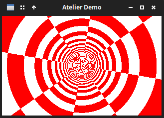

> **Pour aller plus loin :** ajouter des contrôles pour agir sur la rotation et l’avancement. Essayez aussi de générer des textures plus complexes, ou de charger des images. Une manière accessible à notre niveau de traiter des fichiers images est d’utiliser le format `.PPM` ([Portable PixMap file format](https://fr.wikipedia.org/wiki/Portable_pixmap)) conçu durant les années 80s (on reste dans le thème) pour faciliter les échanges d’images. C’est un fichier au format texte (on pouvait donc les transmettre via messagerie électronique avec un encodage ASCII ou binaire), où chaque pixel est encodé par 3 valeurs pour la couleur (RGB), sa position dans l’image + des informations sur les caractéristiques de l’image (taille, etc.). PGM et PBM sont des variantes pour les images en niveau de gris et noir et blanc respectivement. Des logiciels comme Gimp ou Krita peuvent générer des fichiers PPM. À vous d’écrire la fonction pour les lire à partir des [spécifications](https://netpbm.sourceforge.net/doc/ppm.html) (et en inspectant un fichier .PPM qui est un format d’export possible proposé par Gimp ou Krita).

## 10. Effet 6 : Plasma

On arrive au dernier effet que je vous propose d’implémenter dans cet atelier : l’effet plasma.

C’est un effet qui était un incontournable au début des années 90s sur les machines 16bits, pour lequel on va encore beaucoup manipouler des fonctions trigonométriques (en les combinants). Cet effet produit des surfaces organisques, colorées et fluides, en mouvement constant. Il s’obtient très simplement par la superposition de fonctions sinus (ou plus généralement trigonométriques) prenant comme variables une ou deux dimensions spatiales, plus le temps (soit 2 ou 3 variables en tout). Le problème est que le calcul de fonctions trigonométrique est assez gourmand en ressources sur un ordinateur, on va donc encore une fois utiliser une astuces pour économiser du temps de calcul (vous l’aurez deviné : on générera des tables de précalculs).

On va tout de même expliquer avant d’aller plus loin le problème que pose le calcul des fonctions trigonométriques. Un processeur sait très bien faire des opérations simples comme les additions, les soustractions, les multiplications et les divisions. Pour les fonctions plus exotiques,  c’est une autre paire de manche. Pour donner des ordres de grandeur, une multiplciation ou division sur un `float` prend de 1 à 5 cycles d’horloge, alors que le calcul d’un sinus prend lui de 20 à 100 cycles. On constate déjà qu’il y a une forte variabilité pour ce dernier calcul (qui dépend de la machine, des optimisations…). En tout cas le rapport avec une opération simple est de 1 à 2 ordres de grandeur (10 à 100 **fois** plus de cycles). Un minuscule écran de 320×200 pixels contient déjà 64 000 pixels, passer 100 cycles à calculer un sinus pour chaque pixel prendra déjà, avec un rafraîchissement de 60FPS, 4 milliards de cycles par secondes ! Un ordi à 1,8Ghz réalise 1 800 milliard de cycle par seconde. Jouable, mais pas optimum, et surtout hors de portée sur les machine d’il y a 30 ans. Et on ne parle pas des montées en résolutions.

Pourquoi calculer un sinus prend autant de temps ? En fait si on peut définir mathématiquement un sinus assez simplement, on ne peut pas décomposer les opérations élémentaires qui permettent de le calculer de manière exacte de la même manière qu’on peut le faire pour des opérations impliquant une multiplication (à plusieurs chiffre, à virgule…) par exemple. On peut néanmoins obtenir un résultat approximatif par une succession d’opérations arithmétiques classiques (addition, multiplication…). Ces approximations consistent en le calcul d’une série dont la limite tend vers un sinus. Si vous vous rappelez de vos cours de math de terminale ou de première année de supérieur, il y a des séries qui admettent des fonctions trigonométriques comme limite, notamment certaines séries polynomiales. Par exemple [la série de Taylor](https://fr.wikipedia.org/wiki/S%C3%A9rie_de_Taylor) est connue de tou·te·s les étudiant·e·s en science :
$$
\sin(x) = \sum_{n=0}^{\infty} \frac{(-1)^n}{(2n+1)!} x^{2n+1} = x - \frac{x^3}{3!} + \frac{x^5}{5!} - \frac{x^7}{7!} + \cdots
$$
Plus on va loin dans le caclul de la série, et plus on aura une approximation précise de $sin(x)$. Malheureusement on voit qu’il y a dans cette série des exposants, des factorielles… ça fait beaucoup d’opérations, et ce d’autant plus qu’on calcul des indices élevés de la série qui nous garantissent un haut niveau de précision. Même si on utilise des séries plus économes en calculs (cf. [Tchebychev](https://fr.wikipedia.org/wiki/Polyn%C3%B4me_de_Tchebychev)), on comprend ainsi assez clairement pourquoi cela demande de nombreux calculs, même en faisant un arbitrage serré entre la précision et la complexité des calculs. Aujourd’hui on dispose de nombreux éléments d’optimisation (parallélisation, implémentation en « dur » de l’instruction « sin » dans les processeurs modernes, optimisations diverses par les compilateurs…). Les GPU s’en sortent (5 à 15 cycles) comme d’habitude en parallélisant le calcul et en limitant la précision du calcul. Les microcontrôleurs et les calculatrices utilisent un algorithme ([CORDIC](https://fr.wikipedia.org/wiki/CORDIC)) qui consiste en la réalisation de rotations et de décalages de bits assez efficaces (10 à 30) cycles avec une précision acceptable.

Les calculs pour des effets graphiques peuvent se contenter d’une précision passable. Pour rappel, dans le même ordre d’idée, [un algorithme de manipulation de bit pour estimer l’inverse de la racine carrée d’un `float` de 32 bits](https://fr.wikipedia.org/wiki/CORDIC) qui permettait d’économiser du temps de calcul au prix d’un précision acceptable est devenu très populaire après son implémentation dans Quake III Arena. On a toujours intérêt à être sobre, et en matière de traitement graphique, il est toujours intéressant de réaliser un arbitrage entre précision et temps de calcul.

En conclusion, c’est pour contourner ce coût et rendre l’effet possible sur des machines avec peu de ressources que la demoscene a popularisé la technique des **tables de sinus** : on calcule une seule fois au démarrage un tableau de N valeurs de sin() réparties sur `[0, 2π]`, puis on accède à ce tableau par un simple indice entier. Tout le processus se résume à une lecture mémoire, zéro calcul trigonométrique par frame.

Si vous avez bien compris les techniques mobilisées pour les effets précédents, la présente implémentation ne devrait vous poser aucun problème.

### Modèle mathématique

Comme nous l’avons dit lors de la présentation de l’effet, la valeur du « plasma » en un pixel `(x, y)` au temps `t` est la somme de plusieurs ondes sinusoïdales. Chaque onde a sa propre fréquence spatiale et sa propre phase temporelle :

```
v1(x, y, t) = sin(x * fx1 + t * ft1) // onde plane de base selon dimension x
v2(x, y, t) = sin(y * fy2 + t * ft2) // onde plane debase selon dimension y
v3(x, y, t) = sin((x + y) * fxy + t * ft3) // on mixe les deux dimensions spatiales
v4(x, y, t) = sin(sqrt((x - cx)² + (y - cy)²) * fr + t * ft4) // équation de cercle

plasma(x, y, t) = (v1 + v2 + v3 + v4) / 8.0 + 0.5   // valeur dans [0, 1]
```

> Si vous voulez voir à quoi ressemble chaque fonction individuellement, n’hésitez pas à les tracer soit avec un petit script matplolib soit sur gnuplot (de nombreux site en proposent une instance en ligne)

La dernière onde `v4` est particulièrement intéressante : elle est radiale, centrée en `(cx, cy)`, et crée des anneaux concentriques qui s'animent. Vous pouvez trouver d’autre fonctions (notamment paramétriques) qui réalisent des formes intéressantes, n’hésitez pas à faire vos recherches ou expérimentations. En déplaçant `(cx, cy)` selon le temps (avec des sinus), les anneaux se déforment et s'entremêlent avec les ondes planes.

La valeur finale, normalisée dans `[0, 1]`, est convertie en couleur via une palette (ou directement en RGB avec des sinus déphasés sur chaque canal, comme on l’a vu sur le palette cycling).

Calculer comment normaliser la somme de plusieurs fonction peut être source d’erreur : comment trouver par quel nombre il faut diviser à la fin ? Voilà un exemple pour en comprendre la logique (pour que vous puissiez l’adapter dans le cas où vous utilisiez un nombre différent de fonction ou des fonctions au comportement différent) :

Nous combinons 4 ondes et l’on veut ramener la somme de ces quatre ondes dans l'intervalle `[0 ; 1]` pour pouvoir l'utiliser comme argument d'une palette ou d'une conversion RGB. Chaque onde `vi` est un sinus, donc appartenant à l’intervalle `[-1 ; 1]`. La somme des quatre sinus tombe donc dans `[-4 ; 4]`. Pour normaliser `[-4 ; 4]` vers `[0 ; 1]` on applique la transformation affine classique :

```
valeur_normalisée = (somme - min) / (max - min)
                  = (somme - (-4)) / (4 - (-4))
                  = (somme + 4) / 8
                  = somme / 8 + 0.5
```

Une manière intuitive de voir cette formule est de se dire qu’on ramène [-4 ; 4] à [-0.5 ; 0.5] en divisant par 8, qu’on décale ensuite jsuqu’à [0 ; 1] en ajoutant +0.5. 

### Optimisation : tables de sinus précalculées

Appeler `sinf` pour chaque pixel de chaque frame est coûteux. La technique classique est de précalculer un tableau de `sin` pour 256 ou 1024 valeurs, puis d'utiliser des indices entiers. Avec une précision suffisante, l'effet est indiscernable de la version calculée à la volée.

```c
#define SIN_TABLE_SIZE 1024
static float sin_table[SIN_TABLE_SIZE];

void init_sin_table(void) {
    for (int i = 0; i < SIN_TABLE_SIZE; i++)
        sin_table[i] = sinf(2.0f * (float)M_PI * i / SIN_TABLE_SIZE);
}

// Accès rapide : convertir un angle en indice
#define SIN_RAPIDE(angle_rad) \
    sin_table[((int)((angle_rad) * SIN_TABLE_SIZE / (2.0f * M_PI))) & (SIN_TABLE_SIZE - 1)]
```

Il est nécessaier d’expliquer la dernière macro, qui fait 3 choses successives :

1. Convertir l'angle en indice flottant

```c
(angle_rad) * SIN_TABLE_SIZE / (2.0f * M_PI)
```

Si on veut rapidement trouver le sinus d’un angle dans la table, il faut être capable de savoir à quel indice on doit se rendre pour un angle donné. Trouver cette correspondance c’est faire correspondre l'intervalle `[0, 2π]` à l'intervalle `[0, SIN_TABLE_SIZE[`. On peut s’en sortir avec une bête règle de trois : un angle de `2π` (l’angle le plus grand, ou le dernier angle) correspond à l'indice `SIN_TABLE_SIZE `(la fin du tableau), donc un angle quelconque correspond à `angle * SIN_TABLE_SIZE / (2π)`. Par exemple avec `SIN_TABLE_SIZE = 1024` et `angle = π/2` : `(π/2) * 1024 / (2π) = 256`  soit le quart de la table, ce qui est correct π/2 étant le quart de 2π.

2. Tronquer en entier

```c
(int)(...)
```

La manip précédente nous retourne un `float`, or nous avons besoin d’un indice entier pour aller chercher la valeur correspondante dans le tableau. On fait donc la conversion en entier. C’est cet arrondi qui introduit une légère imprécision dans cette technique : l'angle est arrondi à la résolution de la table. Avec 1024 entrées la résolution est de `2π/1024 ≈ 0.006` radian, ce qui est largement suffisant pour un effet visuel.

3. Masquage pour le bouclage

```c
& (SIN_TABLE_SIZE - 1)
```

On a déjà utilisé cette astuce de remplacer un modulo par une opération de masquage sur les bits. C'est l'équivalent rapide de `% SIN_TABLE_SIZE`. Cette astuce fonctionne uniquement parce que `SIN_TABLE_SIZE = 1024 = 2^10`. En binaire, `1023 = 0b0000001111111111`. Le AND (&) binaire avec ce masque conserve uniquement les 10 bits de poids faible, ce qui revient à garder la valeur dans `[0, 1023]`. Cela gère automatiquement les angles négatifs et les angles supérieurs à `2π` : un indice de `1025` devient `1`, un indice de `-1` devient `1023`.

C'est pour cette raison que `SIN_TABLE_SIZE` doit impérativement être une puissance de deux : si on choisissait `1000`, le masquage ne fonctionnerait plus et il faudrait revenir à `%` qui est nettement plus lent.

### Détermination des couleurs

Il y a deux approches possibles :

**Palette externe** (comme dans l'effet palette cycling) : on mappe la valeur normalisée sur un indice 0–255, et on lit la couleur dans un tableau de palette. Cela découple la forme du plasma de ses couleurs, et on économise encore du temps de calcul.

**Palette par canaux sinus** : chaque canal RGB est un sinus de la valeur de plasma, avec un déphasage différent. C'est la méthode la plus simple car on peut l’appliquer directement dans le code et elle donne des couleurs riches.

```c
// v est dans [0, 1]
uint8_t r = (uint8_t)(128 + 127 * sinf(v * 6.28f));
uint8_t g = (uint8_t)(128 + 127 * sinf(v * 6.28f + 2.09f));
uint8_t b = (uint8_t)(128 + 127 * sinf(v * 6.28f + 4.19f));
buffer[y * LARGEUR + x] = MFB_RGB(r, g, b);
```

### Implémentation finale (résultat)

L’implémentation finale est ici aussi suffisamment simple pour qu’il soit inutile d’en donner le détail (criez sinon !). Vous devriez obtenir quelque chose comme cela (ici avec 5 ondes dont 4 radiales) :

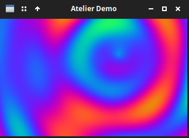

> **Pour aller plus loin** : Supprimez des ondes une à une pour voir leur contribution individuelle. Modifier les formules de chaque ondes sur le plan spatial ou temporel. Remplacez nos tables précalculées par `sinf` par `cosf` (calcul à la volée) sur certaines ondes et comparez le temps d’exécution avec la version implémentant la table de sinus précalculée ( avec `mfb_timer_delta`). Le gain du précalcul devrait être perceptible. Utilisez la palette de l'effet palette cycling à la place de la conversion directe en RGB.
>
> [La démo Goa de The Black Lotus](https://www.youtube.com/watch?v=G1CfmZCbhQs) avait marqué les esprits avec un choix judicieux de palette pour leur effet plasma, et en mélangeant avec un effet tunnel !

## Annexes

### Récapitulatif des fonctions minifb utilisées

| Fonction                        | Rôle                                              |
|---------------------------------|---------------------------------------------------|
| `mfb_open_ex(titre, w, h, flags)` | Crée une fenêtre                                |
| `mfb_close(win)`                | Ferme la fenêtre                                  |
| `mfb_update_ex(win, buf, w, h)` | Affiche le buffer et traite les événements        |
| `mfb_wait_sync(win)`            | Attend le prochain intervalle de frame            |
| `mfb_set_target_fps(fps)`       | Définit le FPS cible (par défaut 60)              |
| `mfb_timer_create()`            | Crée un timer haute résolution                    |
| `mfb_timer_destroy(t)`          | Libère un timer                                   |
| `mfb_timer_now(t)`              | Temps en secondes depuis la création              |
| `mfb_timer_delta(t)`            | Temps en secondes depuis le dernier appel         |
| `mfb_set_keyboard_callback(win, fn)` | Enregistre un callback clavier              |
| `mfb_get_key_buffer(win)`       | Buffer d'état des touches (tableau d'octets)      |
| `MFB_RGB(r, g, b)`              | Construit une couleur 32 bits                     |

### Pistes de lecture pour aller plus loin

- [lodev.org/cgtutor](https://lodev.org/cgtutor) : Tutoriels C/C++ (SDL) très courts mais très clairs sur de nombreux effets démo/rétro (fire effect le plasma…) et autres fondamentaux de la programmation graphique (niveaux, filtres, analyse spectrale, raycasting, etc.). Code plus ou moins directement transposable dans minifb.
- [sizecoding.org](http://www.sizecoding.org/wiki/Main_Page) : Un wiki pour apprendre à créer des effets démos. Pseudocode, théorie et machines/cpu d’époque (ou modernes, y compris les fantasy consoles).
- [seancode.com/demofx](https://seancode.com/demofx) : Explication intuitive du rotozoom, fire, tunnel et plasma avec code source (Typescript).
- [github.com/flightcrank/demo-effects](https://github.com/flightcrank/demo-effects) : Collection d'effets demoscene en C, chacun dans un fichier autonome.
- [github.com/ponceto/dosfx](https://github.com/ponceto/dosfx) : Effets Turbo-C pour DOS, code minimal et historique
- Chaînes/playlsits Youtube (pour l’inspiration, peu de chaînes proposent des tuto, ceux-ci sont plutôt écrits, réf. ci-dessus) : 
  - [une sélection de démo PC des années 90 à 2010](https://www.youtube.com/watch?v=ugPZnsRHUkc&list=PLCZfGAvgXhFEP-VB97dY2OQxsLLN7U8e6)
  - [une sélection de démo Amiga (16bits)](https://www.youtube.com/watch?v=RPdB_zdyMbM&list=PLwds84NCmJadTeGeeXBzVuKWsdwi2Y6PB)
  - [une sélection de démos C64 (8bits, 64ko de mémoire )](https://www.youtube.com/watch?v=3crySbzOy-E&list=PLsyTxSTQmimQWnOddcGBXpbLjEPbN49GV)
  - [Pharmageddon, une démo sur une croix de pharmacie !](https://www.youtube.com/watch?v=Ea7pn92W-Kg)
- Canaux Reddit : [r/creativecoding](https://www.reddit.com/r/creativecoding/), [r/computergraphics](https://www.reddit.com/r/computergraphics/) ou encore [r/Demoscene](https://www.reddit.com/r/Demoscene/) pour les plus généraux, chaque machine d’époque doit avoir des canaux dédiés.
